<link href="capitulo-02-dados-economicos_files/libs/htmltools-fill-0.5.8.1/fill.css" rel="stylesheet" />
<script src="capitulo-02-dados-economicos_files/libs/htmlwidgets-1.6.4/htmlwidgets.js"></script>
<script src="capitulo-02-dados-economicos_files/libs/plotly-binding-4.11.0/plotly.js"></script>
<script src="capitulo-02-dados-economicos_files/libs/setprototypeof-0.1/setprototypeof.js"></script>
<script src="capitulo-02-dados-economicos_files/libs/typedarray-0.1/typedarray.min.js"></script>
<script src="capitulo-02-dados-economicos_files/libs/jquery-3.5.1/jquery.min.js"></script>
<link href="capitulo-02-dados-economicos_files/libs/crosstalk-1.2.2/css/crosstalk.min.css" rel="stylesheet" />
<script src="capitulo-02-dados-economicos_files/libs/crosstalk-1.2.2/js/crosstalk.min.js"></script>
<link href="capitulo-02-dados-economicos_files/libs/plotly-htmlwidgets-css-2.11.1/plotly-htmlwidgets.css" rel="stylesheet" />
<script src="capitulo-02-dados-economicos_files/libs/plotly-main-2.11.1/plotly-latest.min.js"></script>

# Dados Económicos

Os dados são fundamentais para a análise econométrica. Neste capítulo,
vamos explorar os diferentes tipos de dados económicos, as suas
características específicas e como manipulá-los adequadamente.

## Tipos de dados

Existem dois tipos principais de dados: quantitativos e qualitativos. Os
**dados quantitativos** são dados numéricos que podem ser medidos,
enquanto os **dados qualitativos** são dados categóricos que não podem
ser medidos, mas podem ser classificados.

### Dados Quantitativos

Os dados quantitativos podem ser subdivididos em dados discretos e dados
contínuos.

- Os *dados discretos* assumem valores inteiros e contáveis. Por
  exemplo, o número de filhos, o número de alunos de uma turma, etc.
- Os *dados contínuos* podem assumir qualquer valor dentro de um
  intervalo. Por exemplo, a altura de uma pessoa, o peso de um objeto ou
  a temperatura de uma região.

Existem dados contínuos mas que são medidos como os discretos. Isto
acontece porque muitas vezes utilizamos uma escala de medição que limita
a precisão da medida. Por exemplo, a altura de uma pessoa pode ser
medida em centímetros, mas muitas vezes é arredondada para o inteiro
mais próximo, como 169 cm. Contudo, sabemos que a altura real pode ser
169,2 cm ou 168,888(8) cm.

### Dados qualitativos

Os dados qualitativos são dados categóricos que não podem ser medidos,
mas podem ser classificados. Existem dois tipos de dados qualitativos:
dados nominais e dados ordinais.

- Os *dados nominais* são dados categóricos que não podem ser ordenados.
  Exemplos de dados nominais são a cor dos olhos, o estado civil, etc.

- Os *dados ordinais* são dados categóricos que podem ser ordenados.
  Exemplos de dados ordinais são o grau de satisfação, a classe social,
  nível de escolaridade, classe etária, etc.

## Estrutura de dados

1.  **Dados seccionais**: dados recolhidos num único momento de tempo.
    Em termos de numenclatura referimos que $\color{purple}i$ é o número
    de observações (entidades). Uma entidade pode ser um país, um
    distrito, uma empresa, um indivíduo.

    | id  |  Y  |  X  |  W  |  Z  |
    |:----|:---:|:---:|:---:|:---:|
    | 1   |     |     |     |     |
    | 2   |     |     |     |     |
    | 3   |     |     |     |     |
    | 4   |     |     |     |     |
    | …   |     |     |     |     |

    Tabela 1: Exemplo da estrutura de dados seccionais O id representa
    as entidades. *ID*, genericamente, significa identificador. Y,X,W,Z
    são variáveis.

2.  **Séries temporais**: dados recolhidos ao longo do tempo.
    $\color{purple}t$ é o número de observações (tempo). Os dados são
    recolhidos para uma única entidade. As séries temporais podem ter
    frequência anual, semestral, trimestral, mensal, diária (5 dias
    úteis ou 7 dias por semana), intradiáriários (horários, minutos,
    segundos), etc.

    | time |  Y  |  X  |  W  |  Z  |
    |------|:---:|:---:|:---:|:---:|
    | 2020 |     |     |     |     |
    | 2021 |     |     |     |     |
    | 2022 |     |     |     |     |
    | 2023 |     |     |     |     |
    | …    |     |     |     |     |

    Tabela 2: Exemplo da estrutura de séries temporais (dados anuais)

3.  **Dados em painel**: dados recolhidos ao longo do tempo de forma
    consecutiva e para várias entidades do mesmo tipo. São uma
    conjugação das características dos dados seccionais e das séries
    temporais. $\color{purple}i$ é o número de entidades e
    $\color{purple}t$ é o número de observações (tempo).
    $\color{purple}N$ é o número de observações do painel
    $\color{purple}N = i\times t$.

    | país | ano  |  Y  |  X  |  W  |  Z  |
    |------|------|:---:|:---:|:---:|:---:|
    | PT   | 2021 |     |     |     |     |
    | PT   | 2022 |     |     |     |     |
    | PT   | 2023 |     |     |     |     |
    | ES   | 2021 |     |     |     |     |
    | ES   | 2022 |     |     |     |     |
    | ES   | 2023 |     |     |     |     |

    Tabela 3: Exemplo da estrutura de dados em painel

Os painéis podem ser:

- *balanceados*: todas as entidades têm o mesmo número de observações.

- *não balanceados*: as entidades têm um número diferente de
  observações.

- *macropainel*: em que o $\color{purple}t>i$.

- *micropainel*: em que o $\color{purple}t<i$.

Na estrutura de dados em painel a frequência dos dados é a mesma para
todas as entidades, sendo que as entidades são todas do mesmo tipo.

4.  **Dados espaciais**: dados recolhidos no espaço (e.g. dados
    geográficos)

- dados vetoriais: dados representados por pontos (exemplo: localização
  de cidades), linhas (exemplo: estradas) ou polígonos (exemplo:
  fronteiras de países)
- *dados raster* : dados representados por uma grelha de células
  (exemplo: mapas de calor)

## Fontes de dados

Os dados podem ser classificados em duas categorias: *dados primários* e
*dados secundários*. Os dados primários são dados que são recolhidos
diretamente pelo investigador (por exemplos: questionários, entrevistas,
ou mesmo através de experiências). Os dados secundários são dados que
são recolhidos por outra pessoa ou organização (por exemplo: Bando de
Portugal, INE, Eurostat, Banco Mundial, etc).

Alguns exemplos de fontes de dados oficiais:

- World Development Indicators do Banco Mundial-
  <https://databank.worldbank.org/>
- Eurostat - <https://ec.europa.eu/eurostat>
- INE (Instituto Nacional de Estatística) - <https://www.ine.pt/>
- Banco de Portugal - <https://bpstat.bportugal.pt/>

O processo para obter dados é relativamente semelhantes entre as várias
fontes oficiais, mesmo sem um link direto. Esta costuma ser padrão:

1.  Aceder ao site genérico
2.  Procurar o separador ou secção “Dados” / “Estatísticas”
3.  Selecionar o conjunto de dados através do esquema em árvore ou por
    temas
4.  Selecionar amostra e horizonte temporal
5.  Seguir as instruções para download ou visualização

Dependendo da fontes dos dados, pode ser possível recolher várias
variáveis em simultâneo ou apenas uma. No caso do segundo é necessário
juntar os dados (próxima secção) através de um identificador comum. Este
identificador deve ser único para cada observação e deve estar presente
em todos os conjuntos de dados que pretendemos combinar. O identificar
pode ser uma ou mais colunas. Para séries temporais é a colunas de tempo
(ano, mês, etc) e para dados em painel são as colunas de identificação
das entidades (exemplo: país, região, empresa, etc) e de tempo (ano,
mês, etc).

É muito importante perceber se a fonte dos dados é fidedigna. Por vezes
também é necessário analsiar a metodologia de recolha ou cálculo de uma
determinada variável. Por exemplo nonaco mundial quando recolhemos uma
variável e que por

## Preparar os dados

Carregar o `package` `dplyr` ou o `tidyverse`. O `tidyverse` é um
conjunto de packages, como `ggplot2`, `dplyr` e o `tidyr` que é
utilizado dinamizar ou anular a dinamização de colunas. Mais informação
do package `tidyr` [aqui](https://tidyr.tidyverse.org/). Mais informação
acerca do `package` dplyr
[aqui](https://rstudio.github.io/cheatsheets/data-transformation.pdf).

``` r
#manipular dados
library(tidyverse)
```

### Recolher dados

Para este exemplo vamos utilizar os do WDI para Portugal, Espanha e
France com o hironte temporal 1960-2024.

As variáveis selecionais são:

| Indicador                                    | Código         |
|----------------------------------------------|----------------|
| GDP (constant LCU)                           | NY.GDP.MKTP.KN |
| GDP (current LCU)                            | NY.GDP.MKTP.CN |
| GDP deflator (base year varies by country)   | NY.GDP.DEFL.ZS |
| Exports of goods and services (constant LCU) | NE.EXP.GNFS.KN |
| Imports of goods and services (constant LCU) | NE.IMP.GNFS.KN |
| Trade (% of GDP)                             | NE.TRD.GNFS.ZS |
| Population, total                            | SP.POP.TOTL    |

Tabela 4: Indicadores a recolher do WDI

LCU significa “Local Currency Unit” que neste caso são Euros. Podemos
aceder ao site <https://databank.worldbank.org/> e selecionar os dados
ou utilizar o package `WDI`. Para este exemplo vamos recolher os dados
através do package.

``` r
#limpar ambiente
rm(list=ls())

#carregar biblioteca
library(WDI)

dados <- WDI::WDI(country = c("PT", "ES", "FR"), 
              indicator = c("NY.GDP.MKTP.KN", 
              "NY.GDP.MKTP.CN", "NY.GDP.DEFL.ZS", 
              "NE.EXP.GNFS.KN", "NE.IMP.GNFS.KN", 
              "NE.TRD.GNFS.ZS", "SP.POP.TOTL"), 
              start = 1960, end = 2024)

head(dados)
```

### Limpeza de dados

Os dados já estão num formato de dados em Painel. Contudo existem
algumas inconsistências que precisam de ser tratadas. Por exemplo o nome
das colunas é o código e não o nome do indicador ou uma abreviatura.
Existem também algumas colunas que não têm interesse como a coluna
`iso2c` e `iso3c` que contém os códigos dos países.

``` r
colnames(dados)
```

Tendo isto em conta vamos alterar o nome das colunas de acordo com:

| Código         | Abreviatura |
|----------------|-------------|
| NY.GDP.MKTP.KN | gdp         |
| NY.GDP.MKTP.CN | gdp_c       |
| NY.GDP.DEFL.ZS | deflator    |
| NE.EXP.GNFS.KN | x           |
| NE.IMP.GNFS.KN | m           |
| NE.TRD.GNFS.ZS | trade       |
| SP.POP.TOTL    | pop         |

Tabela 5: abreviaturas dos indicadores do WDI

E também remover as colunas `iso2c` e `iso3c`. Existe várias formas de
de remover colunas no R, como por exemplo utilizando a função `select`
do `dplyr`. Praa alterar os nomes das variáveis vamos utilizar a função
`rename`. Podemos fazer em separado ou no mesmo bloco de código. Para
isso vamos utilizar o pipe operator. O Pipe operator `%>%` - then, ou
`|>` é utilizado para encadear várias funções. Mais informação
[aqui](https://r4ds.had.co.nz/pipes.html). No R-Studio é possível
utilizar o atalho `Ctrl+Shift+M` para inserir o pipe operator.

Para este exemplo vamos escrever o nome do conjunto do novo conjunto de
dados e os dados que vamos utilizar. Se pretendermos manter os dados
originais e acrescentar um novo data frame, temos de atribuit um novo
nome. Por exemplo `dados1 <- dados` ou `dados <- dados` para manter o
original e criar um novo com as alterações.

``` r
dados <- dados |>
  rename(
    gdp = NY.GDP.MKTP.KN,
    gdp_c = NY.GDP.MKTP.CN,
    deflator = NY.GDP.DEFL.ZS,
    x = NE.EXP.GNFS.KN,
    m = NE.IMP.GNFS.KN,
    trade = NE.TRD.GNFS.ZS,
    pop = SP.POP.TOTL
  ) |>
  select(-iso2c, -iso3c)

head(dados)
```

Como utilizamos o `|>` não é necessário escrever repetidamente o nome do
data frame como no R base. A função `rename()` permite alterar os nomes
das colunas, enquanto a função `select()` permite escolher quais colunas
manter. Neste caso como eram menos colunas para retirar utilizamos o `-`
antes do nome da coluna que pretendemos excluir.

Para vermos o número de observações total utilizamos a função
`summarise()`:

``` r
dados |> summarise(n=n())
```

        n
    1 195

Para obter o nº de valores únicos da colunas, por exemplo para ver o
número de ano por país ou número de países utilizamos a função
`n_distinct()`:

``` r
dados |> summarise(n_distinct(year),
                n_distinct(country))
```

      n_distinct(year) n_distinct(country)
    1               65                   3

Portanto temos 65 anos e 3 países. Para obter uma visão geral dos dados
podemos utilizar a função `summary`:

``` r
dados |> summary()
```

       country               year           gdp                gdp_c          
     Length:195         Min.   :1960   Min.   :3.556e+10   Min.   :4.747e+08  
     Class :character   1st Qu.:1976   1st Qu.:1.973e+11   1st Qu.:5.313e+10  
     Mode  :character   Median :1992   Median :6.198e+11   Median :1.955e+11  
                        Mean   :1992   Mean   :8.330e+11   Mean   :5.866e+11  
                        3rd Qu.:2008   3rd Qu.:1.231e+12   3rd Qu.:1.056e+12  
                        Max.   :2024   Max.   :2.595e+12   Max.   :2.921e+12  
                                                                              
        deflator             x                   m                 trade       
     Min.   :  1.335   Min.   :7.659e+09   Min.   :8.150e+09   Min.   : 25.80  
     1st Qu.: 12.658   1st Qu.:4.383e+10   1st Qu.:4.467e+10   1st Qu.: 41.56  
     Median : 58.254   Median :9.917e+10   Median :1.045e+11   Median : 54.24  
     Mean   : 52.491   Mean   :2.072e+11   Mean   :2.030e+11   Mean   : 52.85  
     3rd Qu.: 87.373   3rd Qu.:3.161e+11   3rd Qu.:3.178e+11   3rd Qu.: 63.20  
     Max.   :120.101   Max.   :8.244e+11   Max.   :8.297e+11   Max.   :101.36  
                       NA's   :20          NA's   :20          NA's   :20      
          pop          
     Min.   : 8630430  
     1st Qu.:10381892  
     Median :39157685  
     Mean   :36197859  
     3rd Qu.:54117618  
     Max.   :68516699  
                       

Com isto, conseguimos obter estatísticas descritivas para cada variável
bem como o número de observações em falta (NA’s) nas variáveis `x`, `m`
e `trade`.

Com a função `filter()` podemos filtrar por linhas em função dos valores
NA’s para uma das variáveis e conseguir preceber quais são os anos com
observações em falta. Para identificar os anos em que existem NA’s
utilizamos a função `is.na()` para cada variável. Posteriormente, a
função `distinct()` permite obter os anos únicos com observações em
falta. Não utilizamos o `<-` pois não pretendemos guardar os dados
filtrados, apenas visualizar os anos com observações em falta.

``` r
dados |> 
  filter(is.na(x) | is.na(m) | is.na(trade)) |>
  distinct(year)
```

       year
    1  1960
    2  1961
    3  1962
    4  1963
    5  1964
    6  1965
    7  1966
    8  1967
    9  1968
    10 1969

Conseguimos perceber que os anos em falta são de 1960 a 1969. Por isso,
com a função `filter()` vamos filtar os dados para excluir esse período,
ou seja, vamos manter apenas os anos a partir de 1970.

``` r
dados <- dados |> 
  filter(year >= 1970)

summary(dados)
```

       country               year           gdp                gdp_c          
     Length:165         Min.   :1970   Min.   :6.572e+10   Min.   :1.163e+09  
     Class :character   1st Qu.:1983   1st Qu.:2.010e+11   1st Qu.:1.196e+11  
     Mode  :character   Median :1997   Median :8.116e+11   Median :3.042e+11  
                        Mean   :1997   Mean   :9.269e+11   Mean   :6.882e+11  
                        3rd Qu.:2011   3rd Qu.:1.313e+12   3rd Qu.:1.121e+12  
                        Max.   :2024   Max.   :2.595e+12   Max.   :2.921e+12  
        deflator             x                   m                 trade       
     Min.   :  1.769   Min.   :7.659e+09   Min.   :8.150e+09   Min.   : 25.85  
     1st Qu.: 29.897   1st Qu.:4.676e+10   1st Qu.:4.500e+10   1st Qu.: 43.21  
     Median : 68.291   Median :1.150e+11   Median :1.168e+11   Median : 55.13  
     Mean   : 61.050   Mean   :2.169e+11   Mean   :2.124e+11   Mean   : 54.41  
     3rd Qu.: 90.606   3rd Qu.:3.273e+11   3rd Qu.:3.199e+11   3rd Qu.: 63.34  
     Max.   :120.101   Max.   :8.244e+11   Max.   :8.297e+11   Max.   :101.36  
          pop          
     Min.   : 8630430  
     1st Qu.:10434332  
     Median :40057389  
     Mean   :37304185  
     3rd Qu.:56108330  
     Max.   :68516699  

Assim obtivemos um painel balanceado. O mesmo procedimento pode ser
aplicado a outras estruturas de dados. Outra forma poderia ser utilizar
a função `na.omit()`. Existem várias formas de lidar com os valores em
falta que vão para além do objetivo deste livro. Alguns exemplos são a
imputação de valores, a utilização de modelos de previsão ou a exclusão
de variáveis.

## Cálculos

Nesta secção vamos utilizar os dados do ficheiro `exemplo_dados.xlsx` de
um repositório do GitHub.

``` r
library(readxl)
library(tidyverse)
library(httr)

# link dos dados
url <- "https://raw.githubusercontent.com/tiagolafonso/Files_Intro_Applied_Econometrics/main/exemplo_dados.xlsx"

#obter dados
GET(url, write_disk(tf <- tempfile(fileext = ".xlsx"), 
                                    overwrite = TRUE))
```

``` r
#transformar dados
wdi <- read_xlsx(tf)

#remover objetos
rm(url,tf)

#ver o nome das colunas
colnames(wdi)
```

    [1] "Time"     "gdp"      "deflator" "x"        "m"        "trade"    "pop"     

Para efetuar cálculos com os dados, podemos utilizar a função
`mutate()`para adicionar novas colunas ao data frame. Por exemplo,
calcular o PIB per capita:

$$
gdppc_t = \frac{gdp_t}{pop_t}
$$

``` r
wdi <- wdi |> mutate(gdp_pc = gdp / pop)

wdi |> select(Time, gdp_pc)
```

    # A tibble: 55 × 2
        Time gdp_pc
       <dbl>  <dbl>
     1  1970   134.
     2  1971   151.
     3  1972   176.
     4  1973   214.
     5  1974   253.
     6  1975   271.
     7  1976   328.
     8  1977   433.
     9  1978   539.
    10  1979   672.
    # ℹ 45 more rows

Em econometria as variáveis *per capita* são úteis para comparar
indicadores económicos entre diferentes unidades (países, regiões, etc.)
ao longo do tempo, controlando o efeito do tamanho da população.

Variação anual do PIB em unidades ou primeira diferença do PIB de ordem
1:

$$
\Delta gdp_t = gdp_t - gdp_{t-1}
$$

e no `R` por:

``` r
wdi <- wdi |> mutate(d_gdp = gdp - lag(gdp))

wdi |> select(Time, gdp, d_gdp)
```

    # A tibble: 55 × 3
        Time        gdp      d_gdp
       <dbl>      <dbl>      <dbl>
     1  1970 1162721000         NA
     2  1971 1302027000  139306000
     3  1972 1516157000  214130000
     4  1973 1845576000  329419000
     5  1974 2218820000  373244000
     6  1975 2466820000  248000000
     7  1976 3066191000  599371000
     8  1977 4092805000 1026614000
     9  1978 5148485000 1055680000
    10  1979 6495968000 1347483000
    # ℹ 45 more rows

A função `lag()` é utilizada para obter o desfasamento de uma variável.
A função tem vários argumentos que permitem ajustar o número de períodos
a desfasar. Por exemplo para 12 períodos (calcular a variação homóloga
de uma variável mensal) a função seria `lag(nome_variável,12)`.

A variação percentual do PIB é dada por:

$$
\Delta gdp_t = \frac{gdp_t - gdp_{t-1}}{gdp_{t-1}}
$$

ou com logaritmos:

$$
\Delta lgdp_t = ln(gdp_t) - ln(gdp_{t-1})
$$

O logarítmo de uma variável é frequentemente utilizado para linearizar
relações não lineares e para estabilizar a variância. Para calcular o
logarítmo da variável `gdp`($lgdp_t=ln(gdp)_t$) por exemplo:

``` r
wdi <- wdi |> mutate(ln_gdp = log(gdp))

wdi |> select(Time, gdp, d_gdp, ln_gdp)
```

    # A tibble: 55 × 4
        Time        gdp      d_gdp ln_gdp
       <dbl>      <dbl>      <dbl>  <dbl>
     1  1970 1162721000         NA   20.9
     2  1971 1302027000  139306000   21.0
     3  1972 1516157000  214130000   21.1
     4  1973 1845576000  329419000   21.3
     5  1974 2218820000  373244000   21.5
     6  1975 2466820000  248000000   21.6
     7  1976 3066191000  599371000   21.8
     8  1977 4092805000 1026614000   22.1
     9  1978 5148485000 1055680000   22.4
    10  1979 6495968000 1347483000   22.6
    # ℹ 45 more rows

No `R` a função `log()` é utilizada para calcular o logaritmo natural.
Para calcular o logaritmo de base 10 é necessário utilizar mais um
argumento da função `log(gdp,base=10)` ou `log10()`.

Também é possível efetuar o cálculo do logaritmo e das diferneças no
mesmo bloco de código dentro da função `mutate()` e separados por
vírgula.

``` r
wdi <- wdi |> mutate(ln_gdp = log(gdp),
                    d_lgdp = ln_gdp - lag(ln_gdp))

wdi |> select(Time, gdp, d_gdp, ln_gdp, d_lgdp)
```

    # A tibble: 55 × 5
        Time        gdp      d_gdp ln_gdp d_lgdp
       <dbl>      <dbl>      <dbl>  <dbl>  <dbl>
     1  1970 1162721000         NA   20.9 NA    
     2  1971 1302027000  139306000   21.0  0.113
     3  1972 1516157000  214130000   21.1  0.152
     4  1973 1845576000  329419000   21.3  0.197
     5  1974 2218820000  373244000   21.5  0.184
     6  1975 2466820000  248000000   21.6  0.106
     7  1976 3066191000  599371000   21.8  0.218
     8  1977 4092805000 1026614000   22.1  0.289
     9  1978 5148485000 1055680000   22.4  0.229
    10  1979 6495968000 1347483000   22.6  0.232
    # ℹ 45 more rows

Nos modelos econométricos são utilizadas variáveis a preços constantes.
Isto permite eliminar o efeito da inflação e refletir apenas as
variações na quantidade. Enquanto que o PIB nominal por exemplo é o
valor total da produção de bens e serviços a preços correntes, o PIB
real é o valor total da produção a preços constantes, ajustado pela
inflação. O PIB real é calculado utilizando um deflator do PIB, que é um
índice de preços que mede a variação dos preços ao longo do tempo.

O PIB a preços constantes é dado por: $$
PIB_{real} = \frac{PIB_{nominal}}{Deflator_{PIB}} \times 100
$$

De acordo com os dados `wdi`, a variável `gdp` representa o PIB a preços
correntes e o `deflator` representa o deflator. Então o PIB real é
calculado da seguinte forma:

``` r
wdi <- wdi |> mutate(gdp_r = gdp / deflator * 100)

wdi |> select(Time, gdp, gdp_r)
```

    # A tibble: 55 × 3
        Time        gdp       gdp_r
       <dbl>      <dbl>       <dbl>
     1  1970 1162721000 65717083000
     2  1971 1302027000 70075211000
     3  1972 1516157000 75692227000
     4  1973 1845576000 84170265000
     5  1974 2218820000 85132214000
     6  1975 2466820000 81430979000
     7  1976 3066191000 87049905000
     8  1977 4092805000 91926960000
     9  1978 5148485000 94515592000
    10  1979 6495968000 99845267000
    # ℹ 45 more rows

O ano base do Deflator é 2020. Por isso, o PIB real é a preços 2020. Por
vezes pode ser útil ou até obrigatório calcular o PIB a preços base de
anos diferentes, por exemplo utilizar variáveis de diferentes bases de
dados. Para calcular o PIB a preços de 2015, é necessário alterar o ano
base do deflator, ou seja:

$$
Deflator_{base2015} = \frac{Deflator_{t}}{Deflator_{2015}} \times 100
$$

Por isso é necessário isolar o deflator de 2015 e dividir todas as
observações do deflator por esse valor. No `R`:

``` r
wdi <- wdi |> 
    mutate(deflator_2015 = deflator / deflator[Time == 2015] * 100)
```

O `[Time==2015]` é utilizado para isolar a linha do deflator para o ano
de 2015. Neste caso é obrigatório utilizar o `==` e não apenas `=`. Este
último é reservado a operações.

Assim, já é possível calcular o PIB a preços de 2015.

``` r
wdi <- wdi |> 
    mutate(gdp_r_2015 = gdp / deflator_2015 * 100)
```

## Gráficos

Os gráficos são uma forma de visualizar os dados e de perceber a relação
entre as variáveis. Existem vários tipos de gráficos, desde gráficos de
barras, gráficos de linhas, gráficos de dispersão, gráficos de caixa,
entre outros. O `R` tem várias funções para criar gráficos, desde as
funções base do `R` até aos `packages` `ggplot2` e `plotly`. O mais
utilizado é o `ggplot2` que permite criar gráficos mais complexos e com
mais opções de personalização, enquanto o `plotly` permite criar
gráficos interativos. Já os gráficos base do `R` são mais simples e
menos personalizáveis, são utilizados para visualizações mais rápidas.

### Preparar dados

Preparar os dados do ficheiro `wdi_data2.xlsx` para utilização com
modelo econométricos. Este ficheiro é diferentes dos anteriores, pois
contém dados em formato longo. No formato longo cada linha representa
uma observação única, com variáveis em colunas. Enquanto que no formato
largo, cada linha representa uma unidade de observação, com várias
colunas para diferentes variáveis. Em econometria os dados são utilizado
no formato largo.

Carregar packages necessários:

``` r
#libraries
library(readxl)
library(tidyverse)
```

O `package` `tidyverse` é um conjunto de packages, como `ggplot2`,
`dplyr` e o `tidyr` que é utilizado dinamizar ou anular a dinamização de
colunas. Mais informação do package `tidyr`
[aqui](https://tidyr.tidyverse.org/).

Importar ficheiro `wdi_data2.xlsx` da pasta diretório

``` r
rm(list=ls())
library(readxl)
wdi <- read_xlsx("wdi_data2.xlsx")
head(wdi)
```

    # A tibble: 6 × 6
      Country_Name Country_Code Series_Name             Series_Code    year    Value
      <chr>        <chr>        <chr>                   <chr>          <chr>   <dbl>
    1 Portugal     PRT          GDP (constant 2015 US$) NY.GDP.MKTP.KD 1974… 8.61e10
    2 Portugal     PRT          GDP (constant 2015 US$) NY.GDP.MKTP.KD 1975… 8.24e10
    3 Portugal     PRT          GDP (constant 2015 US$) NY.GDP.MKTP.KD 1976… 8.81e10
    4 Portugal     PRT          GDP (constant 2015 US$) NY.GDP.MKTP.KD 1977… 9.30e10
    5 Portugal     PRT          GDP (constant 2015 US$) NY.GDP.MKTP.KD 1978… 9.56e10
    6 Portugal     PRT          GDP (constant 2015 US$) NY.GDP.MKTP.KD 1979… 1.01e11

Limpar dados:

1.  Função `select` para excluir coluna `Series_Code`

2.  Função `mutate` acrescentar colunas:

    1.  `substr` extrair os primeiros 4 caracteres da coluna `year`

    2.  `as.numeric` converter coluna `year` para formato número
        inteiro.

3.  Função `pivot_wider` para dinamizar a coluna `Series_Name` pelo
    valor da coluna `Value`

4.  Função `filter` para balancear os dados, uma vez que a coluna
    `C02 emissions (kt)` apenas tem dados de 1990-\>2020

``` r
wdi2 <- wdi %>%
    dplyr::select(-Series_Code)%>%
    dplyr::mutate(
        year=substr(year,1,4),
        year=as.numeric(year)
                   ) %>%
    pivot_wider(names_from = Series_Name,
                values_from = Value) %>%
    dplyr::filter(year>=1990 & year<=2020)
head(wdi2)
```

    # A tibble: 6 × 5
      Country_Name Country_Code  year `GDP (constant 2015 US$)` `CO2 emissions (kt)`
      <chr>        <chr>        <dbl>                     <dbl>                <dbl>
    1 Portugal     PRT           1990             145478331657.               41069.
    2 Portugal     PRT           1991             151833125542.               42768.
    3 Portugal     PRT           1992             153487311625.               46774 
    4 Portugal     PRT           1993             150351141408.               45793.
    5 Portugal     PRT           1994             151801786241.               47303.
    6 Portugal     PRT           1995             158303123480.               50693.

Alterar o nome das colunas de `GDP (constant 2015 US$)` para `GDP` e
`CO2 emissions (kt)` para `CO2`

``` r
wdi2 <- wdi2 %>%
    dplyr::rename(
        GDP=`GDP (constant 2015 US$)`,
        CO2=`CO2 emissions (kt)`
    )
head(wdi2)
```

    # A tibble: 6 × 5
      Country_Name Country_Code  year           GDP    CO2
      <chr>        <chr>        <dbl>         <dbl>  <dbl>
    1 Portugal     PRT           1990 145478331657. 41069.
    2 Portugal     PRT           1991 151833125542. 42768.
    3 Portugal     PRT           1992 153487311625. 46774 
    4 Portugal     PRT           1993 150351141408. 45793.
    5 Portugal     PRT           1994 151801786241. 47303.
    6 Portugal     PRT           1995 158303123480. 50693.

### Gráficos com a função `plot`

A função `plot` é a função base do `R` para criar gráficos. Para criar
um gráfico de dispersão entre as variáveis do dataset `wdi2`:

``` r
plot(wdi2)
```

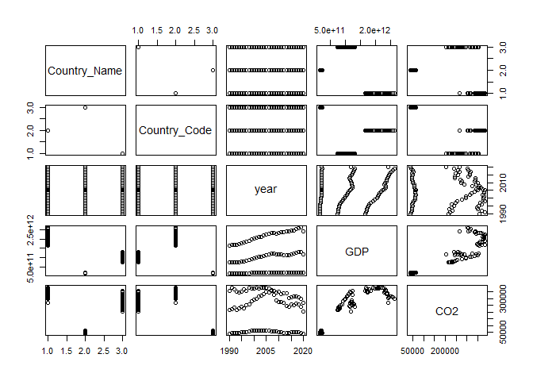

Para criar um gráfico de dispersão entre as variáveis `GDP` e `CO2` do
*data frame*:

``` r
plot(wdi2$GDP,wdi2$CO2)
```

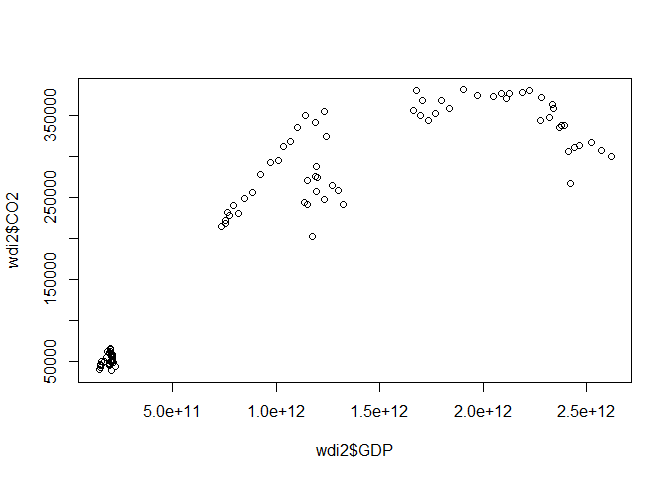

### Gráficos com `ggplot2`

O mesmo gráfico com `ggplot2`:

``` r
ggplot(wdi2,aes(x=GDP,y=CO2))+
    geom_point()
```

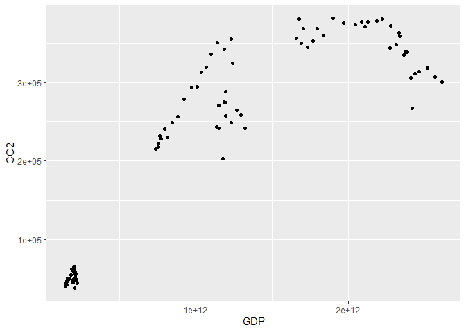

A sintáxe da função `ggplot` é
`ggplot(data,aes(x=variável_x,y=variável_y))` e para adicionar um
gráfico de dispersão é necessário adicionar a função `geom_point()`.
Funciona por camadas, ou seja, é possível adicionar várias camadas ao
gráfico. Também é possível adicionar um título ao gráfico com a função
`labs(title="Título")`.

``` r
ggplot(wdi2,aes(x=GDP,y=CO2))+
    geom_point()+
    labs(title="Gráfico de Dispersão GDP vs CO2")
```

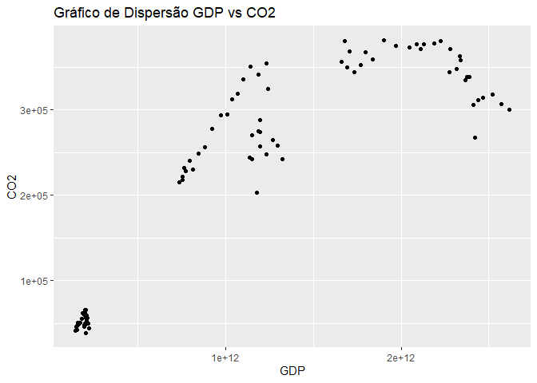

Para alterar a cor dos pontos é necessário adicionar o argumento `color`
à função `aes`. Para alterar a cor dos pontos por `Country_Name`:

``` r
ggplot(wdi2,aes(x=GDP,y=CO2,color=Country_Name))+
    geom_point()+
    labs(title="Gráfico de Dispersão GDP vs CO2")
```

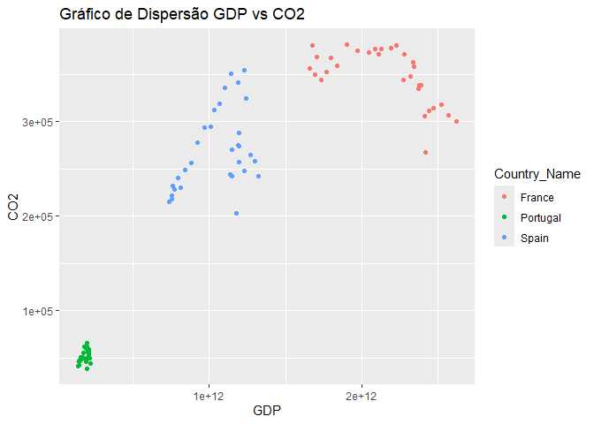

Alterar os título dos eixos `x` e `y` para `GDP (2015 US$)` e
`CO2 (kt)`:

``` r
ggplot(wdi2,aes(x=GDP,y=CO2,color=Country_Name))+
    geom_point()+
    labs(title="Gráfico de Dispersão GDP vs CO2",
        x="GDP (2015 US$)",
        y="CO2 (kt)")+
    theme(plot.title = element_text(hjust = 0.5))
```

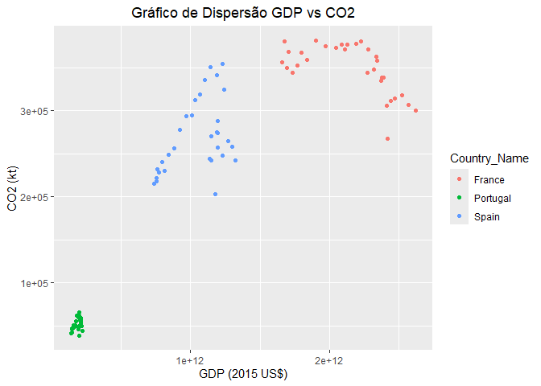

A função `theme` permite alterar o tema do gráfico, neste caso o título
do gráfico é centrado.

Para além disso também é possível adicionar temas pré-definidos ao
gráfico, por exemplo o tema `theme_minimal`:

``` r
ggplot(wdi2,aes(x=GDP,y=CO2,color=Country_Name))+
    geom_point()+
    labs(title="Gráfico de Dispersão GDP vs CO2",
        x="GDP (2015 US$)",
        y="CO2 (kt)")+
    theme_minimal()+
    theme(plot.title = element_text(hjust = 0.5))
```

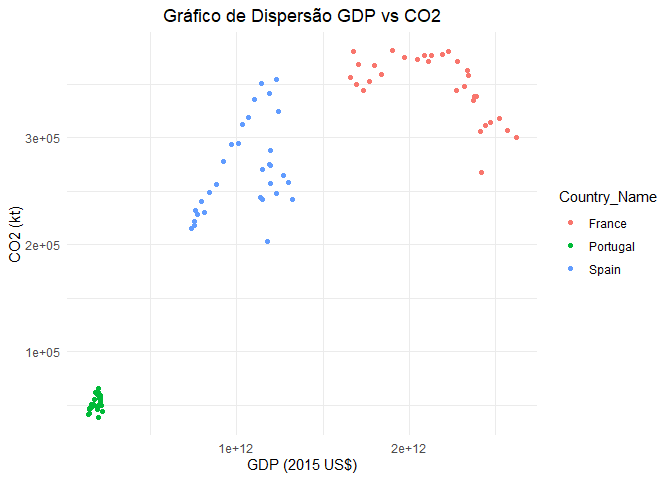

Também é possível adicionar outras camadas, como por exemplo uma linha
de regressão linear com a função `geom_smooth`:

``` r
ggplot(wdi2,aes(x=GDP,y=CO2,color=Country_Name))+
    geom_point()+
    geom_smooth(method="lm",se=FALSE)+
    labs(title="Gráfico de Dispersão GDP vs CO2",
        x="GDP (2015 US$)",
        y="CO2 (kt)")+
    theme_minimal()+
    theme(plot.title = element_text(hjust = 0.5))
```

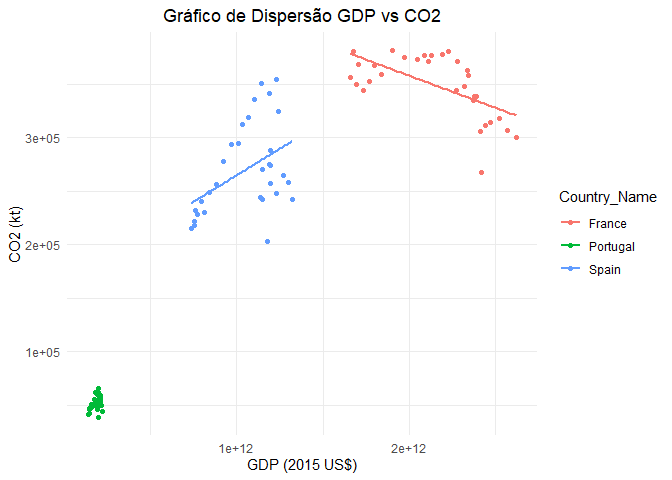

e agora um polinómio de 2º grau:

``` r
ggplot(wdi2,aes(x=GDP,y=CO2,color=Country_Name))+
    geom_point()+
    geom_smooth(method="lm",se=FALSE,formula = y~poly(x,2))+
    labs(title="Gráfico de Dispersão GDP vs CO2",
        x="GDP (2015 US$)",
        y="CO2 (kt)")+
    theme_minimal()+
    theme(plot.title = element_text(hjust = 0.5))
```

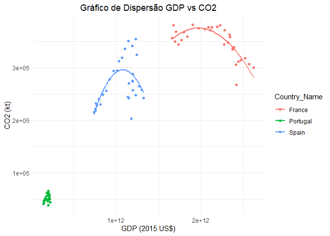

Em suma, a função `ggplot` começa com os dados, e com na função `aes`
são definidos os eixos `x` e `y` e a cor dos pontos.

A primeira camada do gráfico é a função `geom_point` que cria um gráfico
de dispersão, a segunda camada é a função `geom_smooth` que cria uma
linha de regressão linear, a terceira camada é a função `labs` que
adiciona um título ao gráfico e altera o nome dos eixos `x` e `y`, a
quarta camada é a função `theme` que altera o tema do gráfico. Claro que
existem outras funções que podem ser adicionadas ao gráfico e serão
abordadas ao longo das secções.

### Gráficos com `plotly`

O `package` `plotly` permite criar gráficos interativos. Para criar um
gráfico de dispersão interativo entre as variáveis `GDP` e `CO2` do
*data frame* `wdi2`. Preparar os dados:

``` r
#limpar ambiente
rm(list=ls())

#carregar bibliotecas
library(readxl)
library(tidyverse)
library(plotly)

#importar ficheiro de dados
wdi <- read_xlsx("wdi_data2.xlsx")

#limpar data frame
wdi2 <- wdi |>
    dplyr::select(-Series_Code) |>
    dplyr::mutate(
        year=substr(year,1,4),
        year=as.numeric(year)
                   )  |>
    pivot_wider(names_from = Series_Name,
                values_from = Value)  |>
    dplyr::filter(year>=1990 & year<=2020)

#alterar o nome das colunas
wdi2 <- wdi2  |>
    dplyr::rename(
        GDP=`GDP (constant 2015 US$)`,
        CO2=`CO2 emissions (kt)`
    )
```

Gráfico de dispersão com `plotly`:

``` r
plot_ly(wdi2,
        x=~GDP,
        y=~CO2,
        color=~Country_Name,
        type="scatter",
        mode="markers")
```

<div class="plotly html-widget html-fill-item" id="htmlwidget-b59fbaed5b6fb2c81109" style="width:672px;height:480px;"></div>
<script type="application/json" data-for="htmlwidget-b59fbaed5b6fb2c81109">{"x":{"visdat":{"aa9042d43a72":["function () ","plotlyVisDat"]},"cur_data":"aa9042d43a72","attrs":{"aa9042d43a72":{"x":{},"y":{},"mode":"markers","color":{},"alpha_stroke":1,"sizes":[10,100],"spans":[1,20],"type":"scatter"}},"layout":{"margin":{"b":40,"l":60,"t":25,"r":10},"xaxis":{"domain":[0,1],"automargin":true,"title":"GDP"},"yaxis":{"domain":[0,1],"automargin":true,"title":"CO2"},"hovermode":"closest","showlegend":true},"source":"A","config":{"modeBarButtonsToAdd":["hoverclosest","hovercompare"],"showSendToCloud":false},"data":[{"x":[1661090955411.7024,1678502109603.7661,1705347110174.8438,1694626166709.9827,1734592373238.8289,1771133801947.6677,1796159810500.6975,1838123429815.5334,1904087419529.2537,1969233367607.7419,2046499571261.1829,2087096421588.522,2110796058518.4023,2128171303325.761,2188393293109.3516,2224791087607.9087,2279283420792.2778,2334550031985.4214,2340501872979.0425,2273251909006.5205,2317567536989.1377,2368384855035.1729,2375801091055.5366,2389493466482.8091,2412341398046.8433,2439188643162.4985,2465909086487.9365,2522413420333.7812,2569458097202.2368,2616812485718.0073,2419492808873.395],"y":[356297.90000000002,380691.29999999999,368655.70000000001,349524.59999999998,344475.40000000002,352283.09999999998,367959.59999999998,359140.5,381182.29999999999,375003.59999999998,373235.79999999999,376860.29999999999,371167.20000000001,376838.70000000001,377948.5,380816.09999999998,371741,363052.20000000001,358211.20000000001,343882.5,347940.09999999998,335031.90000000002,338315.40000000002,338453.09999999998,306017.40000000002,311175.40000000002,313835.20000000001,317721.20000000001,306948.40000000002,300561.59999999998,267154.70000000001],"mode":"markers","type":"scatter","name":"France","marker":{"color":"rgba(102,194,165,1)","line":{"color":"rgba(102,194,165,1)"}},"textfont":{"color":"rgba(102,194,165,1)"},"error_y":{"color":"rgba(102,194,165,1)"},"error_x":{"color":"rgba(102,194,165,1)"},"line":{"color":"rgba(102,194,165,1)"},"xaxis":"x","yaxis":"y","frame":null},{"x":[145478331657.14844,151833125542.38629,153487311625.17383,150351141407.78827,151801786241.27771,158303123479.59647,163850456044.52731,171061297929.06561,179285861799.30389,186289802829.51129,193398953419.57224,197157995297.65152,198677933649.21207,196829193371.54056,200349947385.1261,201916379874.36826,205197590054.86789,210341031080.27606,211012540457.55612,204424561357.60846,207976694614.76666,204449067168.8237,196153968235.58972,194344164093.78894,195883739714.00067,199394066525.44012,203420800578.6405,210553436228.05728,216552789892.19321,222362381347.61975,203905155102.50415],"y":[41068.599999999999,42767.699999999997,46774,45792.800000000003,47302.900000000001,50693.199999999997,48742.5,50931.599999999999,55600.599999999999,62207.599999999999,61661.199999999997,61383.599999999999,65604.899999999994,60523.599999999999,62128.800000000003,65473.800000000003,60448,58797.599999999999,56844.400000000001,56299.599999999999,50937.300000000003,49867.900000000001,48220.300000000003,46555.199999999997,45931.099999999999,49851.900000000001,48695.199999999997,53272.699999999997,49461.199999999997,44564.699999999997,38973.5],"mode":"markers","type":"scatter","name":"Portugal","marker":{"color":"rgba(252,141,98,1)","line":{"color":"rgba(252,141,98,1)"}},"textfont":{"color":"rgba(252,141,98,1)"},"error_y":{"color":"rgba(252,141,98,1)"},"error_x":{"color":"rgba(252,141,98,1)"},"line":{"color":"rgba(252,141,98,1)"},"xaxis":"x","yaxis":"y","frame":null},{"x":[737305660791.84119,756077467226.83582,763103054853.53931,755231709959.59595,773230356774.81006,794552137824.60889,815691686929.68701,845892627812.49951,883053543058.20264,922707533769.14026,971112252648.43713,1009306124395.3121,1036869753137.109,1067788548860.1559,1101132739762.1089,1141347034482.812,1188172916518.7495,1231003442635.5464,1241923268505.0774,1195188366526.1711,1197135561649.218,1187386271879.2961,1152252436684.7649,1136082395816.7961,1151939554049.6086,1196156971279.6868,1232493518447.6555,1269169576560.1555,1298163367417.968,1323918490148.0461,1176072568933.593],"y":[214950.60000000001,222099.70000000001,232369.60000000001,218079.79999999999,228452.70000000001,240567.29999999999,230113.20000000001,248603.10000000001,256215.5,278300.5,293314.29999999999,294786.79999999999,312753.29999999999,318657.70000000001,335560.29999999999,350499.79999999999,341776.29999999999,354683.09999999998,324274.20000000001,288131.20000000001,274140.59999999998,275470.09999999998,270280.40000000002,243794.89999999999,241979.89999999999,257251.20000000001,248252.10000000001,264723.70000000001,258373.20000000001,241886.5,202705.79999999999],"mode":"markers","type":"scatter","name":"Spain","marker":{"color":"rgba(141,160,203,1)","line":{"color":"rgba(141,160,203,1)"}},"textfont":{"color":"rgba(141,160,203,1)"},"error_y":{"color":"rgba(141,160,203,1)"},"error_x":{"color":"rgba(141,160,203,1)"},"line":{"color":"rgba(141,160,203,1)"},"xaxis":"x","yaxis":"y","frame":null}],"highlight":{"on":"plotly_click","persistent":false,"dynamic":false,"selectize":false,"opacityDim":0.20000000000000001,"selected":{"opacity":1},"debounce":0},"shinyEvents":["plotly_hover","plotly_click","plotly_selected","plotly_relayout","plotly_brushed","plotly_brushing","plotly_clickannotation","plotly_doubleclick","plotly_deselect","plotly_afterplot","plotly_sunburstclick"],"base_url":"https://plot.ly"},"evals":[],"jsHooks":[]}</script>

A função `plotly_ly` começa com os dados, e com `x` e `y` são definidos
os eixos `x` e `y` e a cor dos pontos. O argumento `type` define o tipo
de gráfico, neste caso `scatter` e o argumento `mode` define o tipo de
marcador, neste caso `markers`.

### Gráficos de barras

Para criar um gráfico de barras com a função `barplot`:

``` r
barplot(wdi2$GDP,
        names.arg=paste(wdi2$Country_Name, 
                        wdi2$year, sep="-"),
        las=2)
```

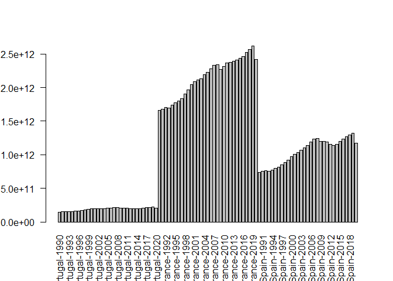

com a função `ggplot2`:

``` r
ggplot(wdi2,aes(x=Country_Name,
                y=GDP,
                fill=Country_Name))+
    geom_bar(stat="identity", 
            position="dodge")+
    labs(title="Gráfico de Barras GDP por País e Ano",
        x="País",
        y="GDP (2015 US$)",
        fill="País")+
    theme_minimal()+
    theme(plot.title = element_text(hjust = 0.5))
```

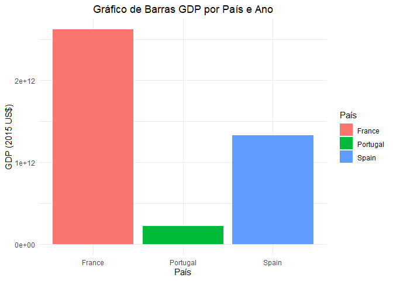

com a função `plotly`:

``` r
plot_ly(wdi2,x=~Country_Name,
            y=~GDP,type="bar",
            color=~Country_Name)
```

<div class="plotly html-widget html-fill-item" id="htmlwidget-a63977db0aee7df66558" style="width:672px;height:480px;"></div>
<script type="application/json" data-for="htmlwidget-a63977db0aee7df66558">{"x":{"visdat":{"aa90f644e7":["function () ","plotlyVisDat"]},"cur_data":"aa90f644e7","attrs":{"aa90f644e7":{"x":{},"y":{},"color":{},"alpha_stroke":1,"sizes":[10,100],"spans":[1,20],"type":"bar"}},"layout":{"margin":{"b":40,"l":60,"t":25,"r":10},"xaxis":{"domain":[0,1],"automargin":true,"title":"Country_Name","type":"category","categoryorder":"array","categoryarray":["France","Portugal","Spain"]},"yaxis":{"domain":[0,1],"automargin":true,"title":"GDP"},"hovermode":"closest","showlegend":true},"source":"A","config":{"modeBarButtonsToAdd":["hoverclosest","hovercompare"],"showSendToCloud":false},"data":[{"x":["France","France","France","France","France","France","France","France","France","France","France","France","France","France","France","France","France","France","France","France","France","France","France","France","France","France","France","France","France","France","France"],"y":[1661090955411.7024,1678502109603.7661,1705347110174.8438,1694626166709.9827,1734592373238.8289,1771133801947.6677,1796159810500.6975,1838123429815.5334,1904087419529.2537,1969233367607.7419,2046499571261.1829,2087096421588.522,2110796058518.4023,2128171303325.761,2188393293109.3516,2224791087607.9087,2279283420792.2778,2334550031985.4214,2340501872979.0425,2273251909006.5205,2317567536989.1377,2368384855035.1729,2375801091055.5366,2389493466482.8091,2412341398046.8433,2439188643162.4985,2465909086487.9365,2522413420333.7812,2569458097202.2368,2616812485718.0073,2419492808873.395],"type":"bar","name":"France","marker":{"color":"rgba(102,194,165,1)","line":{"color":"rgba(102,194,165,1)"}},"textfont":{"color":"rgba(102,194,165,1)"},"error_y":{"color":"rgba(102,194,165,1)"},"error_x":{"color":"rgba(102,194,165,1)"},"xaxis":"x","yaxis":"y","frame":null},{"x":["Portugal","Portugal","Portugal","Portugal","Portugal","Portugal","Portugal","Portugal","Portugal","Portugal","Portugal","Portugal","Portugal","Portugal","Portugal","Portugal","Portugal","Portugal","Portugal","Portugal","Portugal","Portugal","Portugal","Portugal","Portugal","Portugal","Portugal","Portugal","Portugal","Portugal","Portugal"],"y":[145478331657.14844,151833125542.38629,153487311625.17383,150351141407.78827,151801786241.27771,158303123479.59647,163850456044.52731,171061297929.06561,179285861799.30389,186289802829.51129,193398953419.57224,197157995297.65152,198677933649.21207,196829193371.54056,200349947385.1261,201916379874.36826,205197590054.86789,210341031080.27606,211012540457.55612,204424561357.60846,207976694614.76666,204449067168.8237,196153968235.58972,194344164093.78894,195883739714.00067,199394066525.44012,203420800578.6405,210553436228.05728,216552789892.19321,222362381347.61975,203905155102.50415],"type":"bar","name":"Portugal","marker":{"color":"rgba(252,141,98,1)","line":{"color":"rgba(252,141,98,1)"}},"textfont":{"color":"rgba(252,141,98,1)"},"error_y":{"color":"rgba(252,141,98,1)"},"error_x":{"color":"rgba(252,141,98,1)"},"xaxis":"x","yaxis":"y","frame":null},{"x":["Spain","Spain","Spain","Spain","Spain","Spain","Spain","Spain","Spain","Spain","Spain","Spain","Spain","Spain","Spain","Spain","Spain","Spain","Spain","Spain","Spain","Spain","Spain","Spain","Spain","Spain","Spain","Spain","Spain","Spain","Spain"],"y":[737305660791.84119,756077467226.83582,763103054853.53931,755231709959.59595,773230356774.81006,794552137824.60889,815691686929.68701,845892627812.49951,883053543058.20264,922707533769.14026,971112252648.43713,1009306124395.3121,1036869753137.109,1067788548860.1559,1101132739762.1089,1141347034482.812,1188172916518.7495,1231003442635.5464,1241923268505.0774,1195188366526.1711,1197135561649.218,1187386271879.2961,1152252436684.7649,1136082395816.7961,1151939554049.6086,1196156971279.6868,1232493518447.6555,1269169576560.1555,1298163367417.968,1323918490148.0461,1176072568933.593],"type":"bar","name":"Spain","marker":{"color":"rgba(141,160,203,1)","line":{"color":"rgba(141,160,203,1)"}},"textfont":{"color":"rgba(141,160,203,1)"},"error_y":{"color":"rgba(141,160,203,1)"},"error_x":{"color":"rgba(141,160,203,1)"},"xaxis":"x","yaxis":"y","frame":null}],"highlight":{"on":"plotly_click","persistent":false,"dynamic":false,"selectize":false,"opacityDim":0.20000000000000001,"selected":{"opacity":1},"debounce":0},"shinyEvents":["plotly_hover","plotly_click","plotly_selected","plotly_relayout","plotly_brushed","plotly_brushing","plotly_clickannotation","plotly_doubleclick","plotly_deselect","plotly_afterplot","plotly_sunburstclick"],"base_url":"https://plot.ly"},"evals":[],"jsHooks":[]}</script>

### Gráficos de linhas

Para criar um gráfico de linhas com a função `ggplot`:

``` r
ggplot(wdi2,aes(x=year,
                y=GDP,
                color=Country_Name))+
    geom_line()+
    labs(title="Gráfico de Linhas GDP por Ano",
        x="Ano",
        y="GDP (2015 US$)")+
    theme_minimal()+
    theme(plot.title = element_text(hjust = 0.5))
```

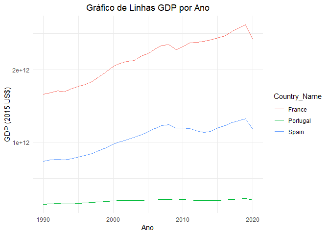

com a função `plotly`:

``` r
plot_ly(wdi2,
      x=~year,
      y=~GDP,
      type="scatter",
      mode="lines",
      color=~Country_Name)
```

<div class="plotly html-widget html-fill-item" id="htmlwidget-f02225519bb280763911" style="width:672px;height:480px;"></div>
<script type="application/json" data-for="htmlwidget-f02225519bb280763911">{"x":{"visdat":{"aa9036c425a6":["function () ","plotlyVisDat"]},"cur_data":"aa9036c425a6","attrs":{"aa9036c425a6":{"x":{},"y":{},"mode":"lines","color":{},"alpha_stroke":1,"sizes":[10,100],"spans":[1,20],"type":"scatter"}},"layout":{"margin":{"b":40,"l":60,"t":25,"r":10},"xaxis":{"domain":[0,1],"automargin":true,"title":"year"},"yaxis":{"domain":[0,1],"automargin":true,"title":"GDP"},"hovermode":"closest","showlegend":true},"source":"A","config":{"modeBarButtonsToAdd":["hoverclosest","hovercompare"],"showSendToCloud":false},"data":[{"x":[1990,1991,1992,1993,1994,1995,1996,1997,1998,1999,2000,2001,2002,2003,2004,2005,2006,2007,2008,2009,2010,2011,2012,2013,2014,2015,2016,2017,2018,2019,2020],"y":[1661090955411.7024,1678502109603.7661,1705347110174.8438,1694626166709.9827,1734592373238.8289,1771133801947.6677,1796159810500.6975,1838123429815.5334,1904087419529.2537,1969233367607.7419,2046499571261.1829,2087096421588.522,2110796058518.4023,2128171303325.761,2188393293109.3516,2224791087607.9087,2279283420792.2778,2334550031985.4214,2340501872979.0425,2273251909006.5205,2317567536989.1377,2368384855035.1729,2375801091055.5366,2389493466482.8091,2412341398046.8433,2439188643162.4985,2465909086487.9365,2522413420333.7812,2569458097202.2368,2616812485718.0073,2419492808873.395],"mode":"lines","type":"scatter","name":"France","marker":{"color":"rgba(102,194,165,1)","line":{"color":"rgba(102,194,165,1)"}},"textfont":{"color":"rgba(102,194,165,1)"},"error_y":{"color":"rgba(102,194,165,1)"},"error_x":{"color":"rgba(102,194,165,1)"},"line":{"color":"rgba(102,194,165,1)"},"xaxis":"x","yaxis":"y","frame":null},{"x":[1990,1991,1992,1993,1994,1995,1996,1997,1998,1999,2000,2001,2002,2003,2004,2005,2006,2007,2008,2009,2010,2011,2012,2013,2014,2015,2016,2017,2018,2019,2020],"y":[145478331657.14844,151833125542.38629,153487311625.17383,150351141407.78827,151801786241.27771,158303123479.59647,163850456044.52731,171061297929.06561,179285861799.30389,186289802829.51129,193398953419.57224,197157995297.65152,198677933649.21207,196829193371.54056,200349947385.1261,201916379874.36826,205197590054.86789,210341031080.27606,211012540457.55612,204424561357.60846,207976694614.76666,204449067168.8237,196153968235.58972,194344164093.78894,195883739714.00067,199394066525.44012,203420800578.6405,210553436228.05728,216552789892.19321,222362381347.61975,203905155102.50415],"mode":"lines","type":"scatter","name":"Portugal","marker":{"color":"rgba(252,141,98,1)","line":{"color":"rgba(252,141,98,1)"}},"textfont":{"color":"rgba(252,141,98,1)"},"error_y":{"color":"rgba(252,141,98,1)"},"error_x":{"color":"rgba(252,141,98,1)"},"line":{"color":"rgba(252,141,98,1)"},"xaxis":"x","yaxis":"y","frame":null},{"x":[1990,1991,1992,1993,1994,1995,1996,1997,1998,1999,2000,2001,2002,2003,2004,2005,2006,2007,2008,2009,2010,2011,2012,2013,2014,2015,2016,2017,2018,2019,2020],"y":[737305660791.84119,756077467226.83582,763103054853.53931,755231709959.59595,773230356774.81006,794552137824.60889,815691686929.68701,845892627812.49951,883053543058.20264,922707533769.14026,971112252648.43713,1009306124395.3121,1036869753137.109,1067788548860.1559,1101132739762.1089,1141347034482.812,1188172916518.7495,1231003442635.5464,1241923268505.0774,1195188366526.1711,1197135561649.218,1187386271879.2961,1152252436684.7649,1136082395816.7961,1151939554049.6086,1196156971279.6868,1232493518447.6555,1269169576560.1555,1298163367417.968,1323918490148.0461,1176072568933.593],"mode":"lines","type":"scatter","name":"Spain","marker":{"color":"rgba(141,160,203,1)","line":{"color":"rgba(141,160,203,1)"}},"textfont":{"color":"rgba(141,160,203,1)"},"error_y":{"color":"rgba(141,160,203,1)"},"error_x":{"color":"rgba(141,160,203,1)"},"line":{"color":"rgba(141,160,203,1)"},"xaxis":"x","yaxis":"y","frame":null}],"highlight":{"on":"plotly_click","persistent":false,"dynamic":false,"selectize":false,"opacityDim":0.20000000000000001,"selected":{"opacity":1},"debounce":0},"shinyEvents":["plotly_hover","plotly_click","plotly_selected","plotly_relayout","plotly_brushed","plotly_brushing","plotly_clickannotation","plotly_doubleclick","plotly_deselect","plotly_afterplot","plotly_sunburstclick"],"base_url":"https://plot.ly"},"evals":[],"jsHooks":[]}</script>

### Gráficos de box plot

Para criar um gráfico de caixa com a função `boxplot`:

``` r
boxplot(wdi2$GDP~wdi2$Country_Name)
```

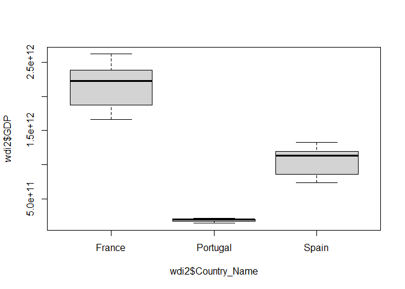

com a função `ggplot`:

``` r
ggplot(wdi2,
            aes(x=Country_Name,
                y=GDP,
                fill=Country_Name)
        )+
    geom_boxplot()+
    labs(title="Gráfico de Caixa GDP por País",
         x="País",
         y="GDP (2015 US$)")+
    theme_minimal()+
    theme(plot.title = element_text(hjust = 0.5))
```

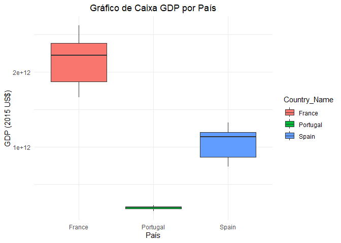

com a função `plotly`:

``` r
plot_ly(wdi2,
        x=~Country_Name,
        y=~GDP,
        type="box",
        color=~Country_Name)
```

<div class="plotly html-widget html-fill-item" id="htmlwidget-0356d8da81367cb65baa" style="width:672px;height:480px;"></div>
<script type="application/json" data-for="htmlwidget-0356d8da81367cb65baa">{"x":{"visdat":{"aa9068c8643d":["function () ","plotlyVisDat"]},"cur_data":"aa9068c8643d","attrs":{"aa9068c8643d":{"x":{},"y":{},"color":{},"alpha_stroke":1,"sizes":[10,100],"spans":[1,20],"type":"box"}},"layout":{"margin":{"b":40,"l":60,"t":25,"r":10},"xaxis":{"domain":[0,1],"automargin":true,"title":"Country_Name","type":"category","categoryorder":"array","categoryarray":["France","Portugal","Spain"]},"yaxis":{"domain":[0,1],"automargin":true,"title":"GDP"},"hovermode":"closest","showlegend":true},"source":"A","config":{"modeBarButtonsToAdd":["hoverclosest","hovercompare"],"showSendToCloud":false},"data":[{"fillcolor":"rgba(102,194,165,0.5)","x":["France","France","France","France","France","France","France","France","France","France","France","France","France","France","France","France","France","France","France","France","France","France","France","France","France","France","France","France","France","France","France"],"y":[1661090955411.7024,1678502109603.7661,1705347110174.8438,1694626166709.9827,1734592373238.8289,1771133801947.6677,1796159810500.6975,1838123429815.5334,1904087419529.2537,1969233367607.7419,2046499571261.1829,2087096421588.522,2110796058518.4023,2128171303325.761,2188393293109.3516,2224791087607.9087,2279283420792.2778,2334550031985.4214,2340501872979.0425,2273251909006.5205,2317567536989.1377,2368384855035.1729,2375801091055.5366,2389493466482.8091,2412341398046.8433,2439188643162.4985,2465909086487.9365,2522413420333.7812,2569458097202.2368,2616812485718.0073,2419492808873.395],"type":"box","name":"France","marker":{"color":"rgba(102,194,165,1)","line":{"color":"rgba(102,194,165,1)"}},"line":{"color":"rgba(102,194,165,1)"},"xaxis":"x","yaxis":"y","frame":null},{"fillcolor":"rgba(252,141,98,0.5)","x":["Portugal","Portugal","Portugal","Portugal","Portugal","Portugal","Portugal","Portugal","Portugal","Portugal","Portugal","Portugal","Portugal","Portugal","Portugal","Portugal","Portugal","Portugal","Portugal","Portugal","Portugal","Portugal","Portugal","Portugal","Portugal","Portugal","Portugal","Portugal","Portugal","Portugal","Portugal"],"y":[145478331657.14844,151833125542.38629,153487311625.17383,150351141407.78827,151801786241.27771,158303123479.59647,163850456044.52731,171061297929.06561,179285861799.30389,186289802829.51129,193398953419.57224,197157995297.65152,198677933649.21207,196829193371.54056,200349947385.1261,201916379874.36826,205197590054.86789,210341031080.27606,211012540457.55612,204424561357.60846,207976694614.76666,204449067168.8237,196153968235.58972,194344164093.78894,195883739714.00067,199394066525.44012,203420800578.6405,210553436228.05728,216552789892.19321,222362381347.61975,203905155102.50415],"type":"box","name":"Portugal","marker":{"color":"rgba(252,141,98,1)","line":{"color":"rgba(252,141,98,1)"}},"line":{"color":"rgba(252,141,98,1)"},"xaxis":"x","yaxis":"y","frame":null},{"fillcolor":"rgba(141,160,203,0.5)","x":["Spain","Spain","Spain","Spain","Spain","Spain","Spain","Spain","Spain","Spain","Spain","Spain","Spain","Spain","Spain","Spain","Spain","Spain","Spain","Spain","Spain","Spain","Spain","Spain","Spain","Spain","Spain","Spain","Spain","Spain","Spain"],"y":[737305660791.84119,756077467226.83582,763103054853.53931,755231709959.59595,773230356774.81006,794552137824.60889,815691686929.68701,845892627812.49951,883053543058.20264,922707533769.14026,971112252648.43713,1009306124395.3121,1036869753137.109,1067788548860.1559,1101132739762.1089,1141347034482.812,1188172916518.7495,1231003442635.5464,1241923268505.0774,1195188366526.1711,1197135561649.218,1187386271879.2961,1152252436684.7649,1136082395816.7961,1151939554049.6086,1196156971279.6868,1232493518447.6555,1269169576560.1555,1298163367417.968,1323918490148.0461,1176072568933.593],"type":"box","name":"Spain","marker":{"color":"rgba(141,160,203,1)","line":{"color":"rgba(141,160,203,1)"}},"line":{"color":"rgba(141,160,203,1)"},"xaxis":"x","yaxis":"y","frame":null}],"highlight":{"on":"plotly_click","persistent":false,"dynamic":false,"selectize":false,"opacityDim":0.20000000000000001,"selected":{"opacity":1},"debounce":0},"shinyEvents":["plotly_hover","plotly_click","plotly_selected","plotly_relayout","plotly_brushed","plotly_brushing","plotly_clickannotation","plotly_doubleclick","plotly_deselect","plotly_afterplot","plotly_sunburstclick"],"base_url":"https://plot.ly"},"evals":[],"jsHooks":[]}</script>

### Gráfico violino

Para criar um gráfico de violino com a função `geom_violin`:

``` r
ggplot(wdi2,
        aes(x=Country_Name,
            y=GDP,
            fill=Country_Name))+
    geom_violin()+
    labs(title="Gráfico de Violino GDP por País",
        x="País",
        y="GDP (2015 US$)")+
    theme_minimal()+
    theme(plot.title = element_text(hjust = 0.5))
```

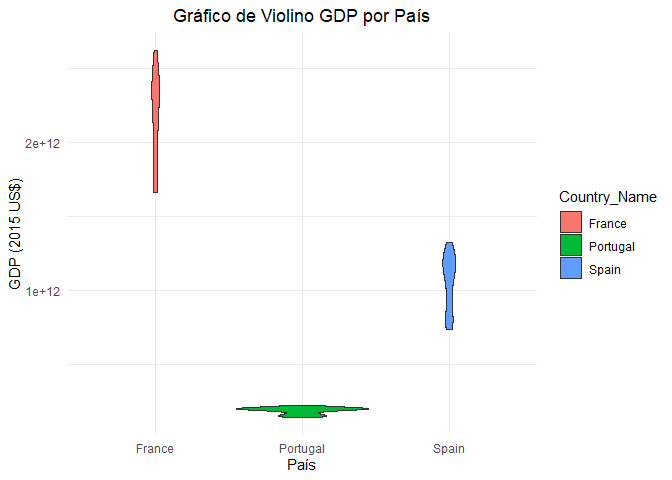

com a função `plotly`:

``` r
plot_ly(wdi2,
        x=~Country_Name,
        y=~GDP,
        type="violin",
        color=~Country_Name)
```

<div class="plotly html-widget html-fill-item" id="htmlwidget-56da0cca7f4e80e2aea6" style="width:672px;height:480px;"></div>
<script type="application/json" data-for="htmlwidget-56da0cca7f4e80e2aea6">{"x":{"visdat":{"aa90605a6e89":["function () ","plotlyVisDat"]},"cur_data":"aa90605a6e89","attrs":{"aa90605a6e89":{"x":{},"y":{},"color":{},"alpha_stroke":1,"sizes":[10,100],"spans":[1,20],"type":"violin"}},"layout":{"margin":{"b":40,"l":60,"t":25,"r":10},"xaxis":{"domain":[0,1],"automargin":true,"title":"Country_Name","type":"category","categoryorder":"array","categoryarray":["France","Portugal","Spain"]},"yaxis":{"domain":[0,1],"automargin":true,"title":"GDP"},"hovermode":"closest","showlegend":true},"source":"A","config":{"modeBarButtonsToAdd":["hoverclosest","hovercompare"],"showSendToCloud":false},"data":[{"fillcolor":"rgba(102,194,165,0.5)","x":["France","France","France","France","France","France","France","France","France","France","France","France","France","France","France","France","France","France","France","France","France","France","France","France","France","France","France","France","France","France","France"],"y":[1661090955411.7024,1678502109603.7661,1705347110174.8438,1694626166709.9827,1734592373238.8289,1771133801947.6677,1796159810500.6975,1838123429815.5334,1904087419529.2537,1969233367607.7419,2046499571261.1829,2087096421588.522,2110796058518.4023,2128171303325.761,2188393293109.3516,2224791087607.9087,2279283420792.2778,2334550031985.4214,2340501872979.0425,2273251909006.5205,2317567536989.1377,2368384855035.1729,2375801091055.5366,2389493466482.8091,2412341398046.8433,2439188643162.4985,2465909086487.9365,2522413420333.7812,2569458097202.2368,2616812485718.0073,2419492808873.395],"type":"violin","name":"France","marker":{"color":"rgba(102,194,165,1)","line":{"color":"rgba(102,194,165,1)"}},"line":{"color":"rgba(102,194,165,1)"},"xaxis":"x","yaxis":"y","frame":null},{"fillcolor":"rgba(252,141,98,0.5)","x":["Portugal","Portugal","Portugal","Portugal","Portugal","Portugal","Portugal","Portugal","Portugal","Portugal","Portugal","Portugal","Portugal","Portugal","Portugal","Portugal","Portugal","Portugal","Portugal","Portugal","Portugal","Portugal","Portugal","Portugal","Portugal","Portugal","Portugal","Portugal","Portugal","Portugal","Portugal"],"y":[145478331657.14844,151833125542.38629,153487311625.17383,150351141407.78827,151801786241.27771,158303123479.59647,163850456044.52731,171061297929.06561,179285861799.30389,186289802829.51129,193398953419.57224,197157995297.65152,198677933649.21207,196829193371.54056,200349947385.1261,201916379874.36826,205197590054.86789,210341031080.27606,211012540457.55612,204424561357.60846,207976694614.76666,204449067168.8237,196153968235.58972,194344164093.78894,195883739714.00067,199394066525.44012,203420800578.6405,210553436228.05728,216552789892.19321,222362381347.61975,203905155102.50415],"type":"violin","name":"Portugal","marker":{"color":"rgba(252,141,98,1)","line":{"color":"rgba(252,141,98,1)"}},"line":{"color":"rgba(252,141,98,1)"},"xaxis":"x","yaxis":"y","frame":null},{"fillcolor":"rgba(141,160,203,0.5)","x":["Spain","Spain","Spain","Spain","Spain","Spain","Spain","Spain","Spain","Spain","Spain","Spain","Spain","Spain","Spain","Spain","Spain","Spain","Spain","Spain","Spain","Spain","Spain","Spain","Spain","Spain","Spain","Spain","Spain","Spain","Spain"],"y":[737305660791.84119,756077467226.83582,763103054853.53931,755231709959.59595,773230356774.81006,794552137824.60889,815691686929.68701,845892627812.49951,883053543058.20264,922707533769.14026,971112252648.43713,1009306124395.3121,1036869753137.109,1067788548860.1559,1101132739762.1089,1141347034482.812,1188172916518.7495,1231003442635.5464,1241923268505.0774,1195188366526.1711,1197135561649.218,1187386271879.2961,1152252436684.7649,1136082395816.7961,1151939554049.6086,1196156971279.6868,1232493518447.6555,1269169576560.1555,1298163367417.968,1323918490148.0461,1176072568933.593],"type":"violin","name":"Spain","marker":{"color":"rgba(141,160,203,1)","line":{"color":"rgba(141,160,203,1)"}},"line":{"color":"rgba(141,160,203,1)"},"xaxis":"x","yaxis":"y","frame":null}],"highlight":{"on":"plotly_click","persistent":false,"dynamic":false,"selectize":false,"opacityDim":0.20000000000000001,"selected":{"opacity":1},"debounce":0},"shinyEvents":["plotly_hover","plotly_click","plotly_selected","plotly_relayout","plotly_brushed","plotly_brushing","plotly_clickannotation","plotly_doubleclick","plotly_deselect","plotly_afterplot","plotly_sunburstclick"],"base_url":"https://plot.ly"},"evals":[],"jsHooks":[]}</script>

Violino e boxplot no mesmo gráfico:

``` r
plot_ly(wdi2,
        x=~Country_Name,
        y=~GDP,
        type="violin",
        color=~Country_Name) %>%
    add_trace(x=~Country_Name,
              y=~GDP,
              type="box",
              boxpoints="all",
              jitter=0.3,
              pointpos=-1.8,
              color=~Country_Name)
```

<div class="plotly html-widget html-fill-item" id="htmlwidget-2d553b446d975d17bbe7" style="width:672px;height:480px;"></div>
<script type="application/json" data-for="htmlwidget-2d553b446d975d17bbe7">{"x":{"visdat":{"aa9031751902":["function () ","plotlyVisDat"]},"cur_data":"aa9031751902","attrs":{"aa9031751902":{"x":{},"y":{},"color":{},"alpha_stroke":1,"sizes":[10,100],"spans":[1,20],"type":"violin"},"aa9031751902.1":{"x":{},"y":{},"color":{},"alpha_stroke":1,"sizes":[10,100],"spans":[1,20],"type":"box","boxpoints":"all","jitter":0.29999999999999999,"pointpos":-1.8,"inherit":true}},"layout":{"margin":{"b":40,"l":60,"t":25,"r":10},"xaxis":{"domain":[0,1],"automargin":true,"title":"Country_Name","type":"category","categoryorder":"array","categoryarray":["France","Portugal","Spain"]},"yaxis":{"domain":[0,1],"automargin":true,"title":"GDP"},"hovermode":"closest","showlegend":true},"source":"A","config":{"modeBarButtonsToAdd":["hoverclosest","hovercompare"],"showSendToCloud":false},"data":[{"fillcolor":"rgba(102,194,165,0.5)","x":["France","France","France","France","France","France","France","France","France","France","France","France","France","France","France","France","France","France","France","France","France","France","France","France","France","France","France","France","France","France","France"],"y":[1661090955411.7024,1678502109603.7661,1705347110174.8438,1694626166709.9827,1734592373238.8289,1771133801947.6677,1796159810500.6975,1838123429815.5334,1904087419529.2537,1969233367607.7419,2046499571261.1829,2087096421588.522,2110796058518.4023,2128171303325.761,2188393293109.3516,2224791087607.9087,2279283420792.2778,2334550031985.4214,2340501872979.0425,2273251909006.5205,2317567536989.1377,2368384855035.1729,2375801091055.5366,2389493466482.8091,2412341398046.8433,2439188643162.4985,2465909086487.9365,2522413420333.7812,2569458097202.2368,2616812485718.0073,2419492808873.395],"type":"violin","name":"France","marker":{"color":"rgba(102,194,165,1)","line":{"color":"rgba(102,194,165,1)"}},"line":{"color":"rgba(102,194,165,1)"},"xaxis":"x","yaxis":"y","frame":null},{"fillcolor":"rgba(252,141,98,0.5)","x":["Portugal","Portugal","Portugal","Portugal","Portugal","Portugal","Portugal","Portugal","Portugal","Portugal","Portugal","Portugal","Portugal","Portugal","Portugal","Portugal","Portugal","Portugal","Portugal","Portugal","Portugal","Portugal","Portugal","Portugal","Portugal","Portugal","Portugal","Portugal","Portugal","Portugal","Portugal"],"y":[145478331657.14844,151833125542.38629,153487311625.17383,150351141407.78827,151801786241.27771,158303123479.59647,163850456044.52731,171061297929.06561,179285861799.30389,186289802829.51129,193398953419.57224,197157995297.65152,198677933649.21207,196829193371.54056,200349947385.1261,201916379874.36826,205197590054.86789,210341031080.27606,211012540457.55612,204424561357.60846,207976694614.76666,204449067168.8237,196153968235.58972,194344164093.78894,195883739714.00067,199394066525.44012,203420800578.6405,210553436228.05728,216552789892.19321,222362381347.61975,203905155102.50415],"type":"violin","name":"Portugal","marker":{"color":"rgba(252,141,98,1)","line":{"color":"rgba(252,141,98,1)"}},"line":{"color":"rgba(252,141,98,1)"},"xaxis":"x","yaxis":"y","frame":null},{"fillcolor":"rgba(141,160,203,0.5)","x":["Spain","Spain","Spain","Spain","Spain","Spain","Spain","Spain","Spain","Spain","Spain","Spain","Spain","Spain","Spain","Spain","Spain","Spain","Spain","Spain","Spain","Spain","Spain","Spain","Spain","Spain","Spain","Spain","Spain","Spain","Spain"],"y":[737305660791.84119,756077467226.83582,763103054853.53931,755231709959.59595,773230356774.81006,794552137824.60889,815691686929.68701,845892627812.49951,883053543058.20264,922707533769.14026,971112252648.43713,1009306124395.3121,1036869753137.109,1067788548860.1559,1101132739762.1089,1141347034482.812,1188172916518.7495,1231003442635.5464,1241923268505.0774,1195188366526.1711,1197135561649.218,1187386271879.2961,1152252436684.7649,1136082395816.7961,1151939554049.6086,1196156971279.6868,1232493518447.6555,1269169576560.1555,1298163367417.968,1323918490148.0461,1176072568933.593],"type":"violin","name":"Spain","marker":{"color":"rgba(141,160,203,1)","line":{"color":"rgba(141,160,203,1)"}},"line":{"color":"rgba(141,160,203,1)"},"xaxis":"x","yaxis":"y","frame":null},{"fillcolor":"rgba(102,194,165,0.5)","x":["France","France","France","France","France","France","France","France","France","France","France","France","France","France","France","France","France","France","France","France","France","France","France","France","France","France","France","France","France","France","France"],"y":[1661090955411.7024,1678502109603.7661,1705347110174.8438,1694626166709.9827,1734592373238.8289,1771133801947.6677,1796159810500.6975,1838123429815.5334,1904087419529.2537,1969233367607.7419,2046499571261.1829,2087096421588.522,2110796058518.4023,2128171303325.761,2188393293109.3516,2224791087607.9087,2279283420792.2778,2334550031985.4214,2340501872979.0425,2273251909006.5205,2317567536989.1377,2368384855035.1729,2375801091055.5366,2389493466482.8091,2412341398046.8433,2439188643162.4985,2465909086487.9365,2522413420333.7812,2569458097202.2368,2616812485718.0073,2419492808873.395],"type":"box","boxpoints":"all","jitter":0.29999999999999999,"pointpos":-1.8,"name":"France","marker":{"color":"rgba(102,194,165,1)","line":{"color":"rgba(102,194,165,1)"}},"line":{"color":"rgba(102,194,165,1)"},"xaxis":"x","yaxis":"y","frame":null},{"fillcolor":"rgba(252,141,98,0.5)","x":["Portugal","Portugal","Portugal","Portugal","Portugal","Portugal","Portugal","Portugal","Portugal","Portugal","Portugal","Portugal","Portugal","Portugal","Portugal","Portugal","Portugal","Portugal","Portugal","Portugal","Portugal","Portugal","Portugal","Portugal","Portugal","Portugal","Portugal","Portugal","Portugal","Portugal","Portugal"],"y":[145478331657.14844,151833125542.38629,153487311625.17383,150351141407.78827,151801786241.27771,158303123479.59647,163850456044.52731,171061297929.06561,179285861799.30389,186289802829.51129,193398953419.57224,197157995297.65152,198677933649.21207,196829193371.54056,200349947385.1261,201916379874.36826,205197590054.86789,210341031080.27606,211012540457.55612,204424561357.60846,207976694614.76666,204449067168.8237,196153968235.58972,194344164093.78894,195883739714.00067,199394066525.44012,203420800578.6405,210553436228.05728,216552789892.19321,222362381347.61975,203905155102.50415],"type":"box","boxpoints":"all","jitter":0.29999999999999999,"pointpos":-1.8,"name":"Portugal","marker":{"color":"rgba(252,141,98,1)","line":{"color":"rgba(252,141,98,1)"}},"line":{"color":"rgba(252,141,98,1)"},"xaxis":"x","yaxis":"y","frame":null},{"fillcolor":"rgba(141,160,203,0.5)","x":["Spain","Spain","Spain","Spain","Spain","Spain","Spain","Spain","Spain","Spain","Spain","Spain","Spain","Spain","Spain","Spain","Spain","Spain","Spain","Spain","Spain","Spain","Spain","Spain","Spain","Spain","Spain","Spain","Spain","Spain","Spain"],"y":[737305660791.84119,756077467226.83582,763103054853.53931,755231709959.59595,773230356774.81006,794552137824.60889,815691686929.68701,845892627812.49951,883053543058.20264,922707533769.14026,971112252648.43713,1009306124395.3121,1036869753137.109,1067788548860.1559,1101132739762.1089,1141347034482.812,1188172916518.7495,1231003442635.5464,1241923268505.0774,1195188366526.1711,1197135561649.218,1187386271879.2961,1152252436684.7649,1136082395816.7961,1151939554049.6086,1196156971279.6868,1232493518447.6555,1269169576560.1555,1298163367417.968,1323918490148.0461,1176072568933.593],"type":"box","boxpoints":"all","jitter":0.29999999999999999,"pointpos":-1.8,"name":"Spain","marker":{"color":"rgba(141,160,203,1)","line":{"color":"rgba(141,160,203,1)"}},"line":{"color":"rgba(141,160,203,1)"},"xaxis":"x","yaxis":"y","frame":null}],"highlight":{"on":"plotly_click","persistent":false,"dynamic":false,"selectize":false,"opacityDim":0.20000000000000001,"selected":{"opacity":1},"debounce":0},"shinyEvents":["plotly_hover","plotly_click","plotly_selected","plotly_relayout","plotly_brushed","plotly_brushing","plotly_clickannotation","plotly_doubleclick","plotly_deselect","plotly_afterplot","plotly_sunburstclick"],"base_url":"https://plot.ly"},"evals":[],"jsHooks":[]}</script>

### Histograma

Para criar um histograma com a função `hist`:

``` r
hist(wdi2$GDP)
```

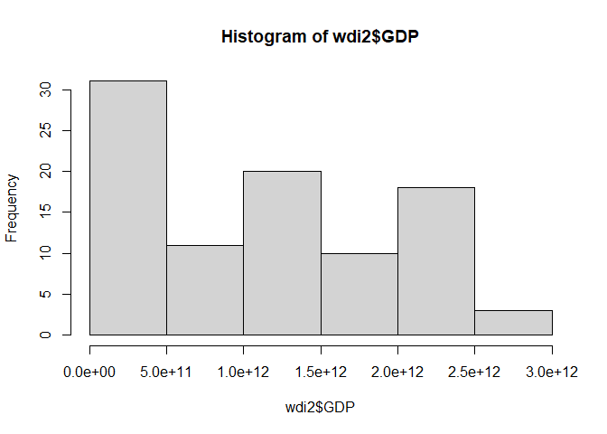

com a função `ggplot`:

``` r
ggplot(wdi2,
       aes(x=GDP,
           fill=Country_Name))+
    geom_histogram()+
    labs(title="Histograma GDP",
        x="GDP (2015 US$)",
        y="Frequência")+
    theme_minimal()+
    theme(plot.title = element_text(hjust = 0.5))
```

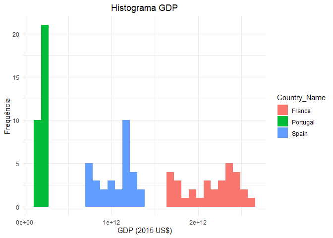

com a função `plotly` para os 3 países:

``` r
plotly::subplot(
    wdi2 %>% filter(Country_Name=="Portugal") %>% 
        plot_ly(x=~GDP,
                type="histogram",
                name="Portugal"),
    wdi2 %>% filter(Country_Name=="Spain") %>% 
        plot_ly(x=~GDP,
                type="histogram",
                name="Spain"),
    wdi2 %>% filter(Country_Name=="France") %>% 
        plot_ly(x=~GDP,
                type="histogram",
                name="France"),
    nrows = 3
)
```

<div class="plotly html-widget html-fill-item" id="htmlwidget-d9e80a76c0fec50f0663" style="width:672px;height:480px;"></div>
<script type="application/json" data-for="htmlwidget-d9e80a76c0fec50f0663">{"x":{"data":[{"x":[145478331657.14844,151833125542.38629,153487311625.17383,150351141407.78827,151801786241.27771,158303123479.59647,163850456044.52731,171061297929.06561,179285861799.30389,186289802829.51129,193398953419.57224,197157995297.65152,198677933649.21207,196829193371.54056,200349947385.1261,201916379874.36826,205197590054.86789,210341031080.27606,211012540457.55612,204424561357.60846,207976694614.76666,204449067168.8237,196153968235.58972,194344164093.78894,195883739714.00067,199394066525.44012,203420800578.6405,210553436228.05728,216552789892.19321,222362381347.61975,203905155102.50415],"name":"Portugal","type":"histogram","marker":{"color":"rgba(31,119,180,1)","line":{"color":"rgba(31,119,180,1)"}},"error_y":{"color":"rgba(31,119,180,1)"},"error_x":{"color":"rgba(31,119,180,1)"},"xaxis":"x","yaxis":"y","frame":null},{"x":[737305660791.84119,756077467226.83582,763103054853.53931,755231709959.59595,773230356774.81006,794552137824.60889,815691686929.68701,845892627812.49951,883053543058.20264,922707533769.14026,971112252648.43713,1009306124395.3121,1036869753137.109,1067788548860.1559,1101132739762.1089,1141347034482.812,1188172916518.7495,1231003442635.5464,1241923268505.0774,1195188366526.1711,1197135561649.218,1187386271879.2961,1152252436684.7649,1136082395816.7961,1151939554049.6086,1196156971279.6868,1232493518447.6555,1269169576560.1555,1298163367417.968,1323918490148.0461,1176072568933.593],"name":"Spain","type":"histogram","marker":{"color":"rgba(255,127,14,1)","line":{"color":"rgba(255,127,14,1)"}},"error_y":{"color":"rgba(255,127,14,1)"},"error_x":{"color":"rgba(255,127,14,1)"},"xaxis":"x2","yaxis":"y2","frame":null},{"x":[1661090955411.7024,1678502109603.7661,1705347110174.8438,1694626166709.9827,1734592373238.8289,1771133801947.6677,1796159810500.6975,1838123429815.5334,1904087419529.2537,1969233367607.7419,2046499571261.1829,2087096421588.522,2110796058518.4023,2128171303325.761,2188393293109.3516,2224791087607.9087,2279283420792.2778,2334550031985.4214,2340501872979.0425,2273251909006.5205,2317567536989.1377,2368384855035.1729,2375801091055.5366,2389493466482.8091,2412341398046.8433,2439188643162.4985,2465909086487.9365,2522413420333.7812,2569458097202.2368,2616812485718.0073,2419492808873.395],"name":"France","type":"histogram","marker":{"color":"rgba(44,160,44,1)","line":{"color":"rgba(44,160,44,1)"}},"error_y":{"color":"rgba(44,160,44,1)"},"error_x":{"color":"rgba(44,160,44,1)"},"xaxis":"x3","yaxis":"y3","frame":null}],"layout":{"xaxis":{"domain":[0,1],"automargin":true,"anchor":"y"},"xaxis2":{"domain":[0,1],"automargin":true,"anchor":"y2"},"xaxis3":{"domain":[0,1],"automargin":true,"anchor":"y3"},"yaxis3":{"domain":[0,0.31333333333333335],"automargin":true,"anchor":"x3"},"yaxis2":{"domain":[0.35333333333333339,0.64666666666666672],"automargin":true,"anchor":"x2"},"yaxis":{"domain":[0.68666666666666676,1],"automargin":true,"anchor":"x"},"annotations":[],"shapes":[],"images":[],"margin":{"b":40,"l":60,"t":25,"r":10},"hovermode":"closest","showlegend":true},"attrs":{"aa90684485d":{"x":{},"name":"Portugal","alpha_stroke":1,"sizes":[10,100],"spans":[1,20],"type":"histogram"},"aa901b226057":{"x":{},"name":"Spain","alpha_stroke":1,"sizes":[10,100],"spans":[1,20],"type":"histogram"},"aa904de74c8":{"x":{},"name":"France","alpha_stroke":1,"sizes":[10,100],"spans":[1,20],"type":"histogram"}},"source":"A","config":{"modeBarButtonsToAdd":["hoverclosest","hovercompare"],"showSendToCloud":false},"highlight":{"on":"plotly_click","persistent":false,"dynamic":false,"selectize":false,"opacityDim":0.20000000000000001,"selected":{"opacity":1},"debounce":0},"subplot":true,"shinyEvents":["plotly_hover","plotly_click","plotly_selected","plotly_relayout","plotly_brushed","plotly_brushing","plotly_clickannotation","plotly_doubleclick","plotly_deselect","plotly_afterplot","plotly_sunburstclick"],"base_url":"https://plot.ly"},"evals":[],"jsHooks":[]}</script>
