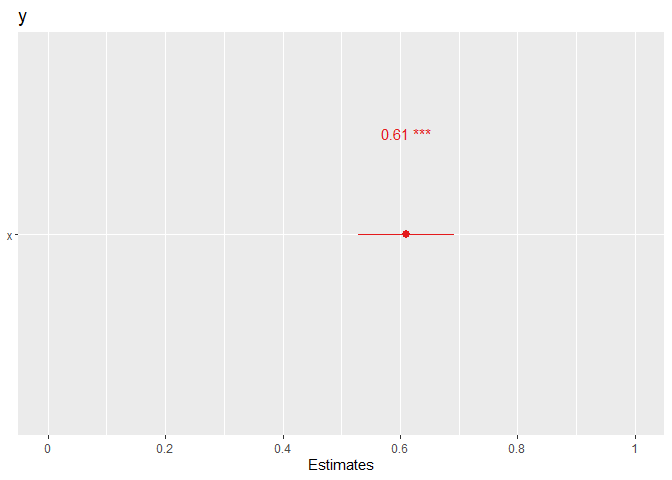

# Regressão linear

Uma regressão é uma técnica que estabelece uma relação entre uma
variável dependente e uma ou mais variáveis independentes. A regressão
linear é um tipo de regressão que estabelece uma relação linear entre a
variável dependente e as variáveis independentes. O objetivo é estudar o
impacto das variáveis independentes na dependente. A variável dependente
também pode ser definida como variável explicada, enquanto que as
independentes também podem ser definidas como variáveis explicativas.
Numa regressão a variável dependente é representada por $y$ e as
variáveis independentes são representadas, genericamente, por
$x_1, x_2, ..., x_k$. O modelo de regressão linear é representado pela
seguinte função:

<span id="eq-modelo-geral">$$
y = f(x_1, x_2,..., x_k)
 \qquad(1)$$</span>

- Exemplo de uma aplicação de uma função: estudar o efeito do salário na
  produtividade dos trabalhadores. Neste caso, a variável dependente é a
  produtividade dos trabalhadores e a variável independente é o salário
  dos trabalhadores. O modelo de regressão linear é representado pela
  seguinte função:

<span id="eq-exemplo-produtividade">$$
produtividade = f(salário)
 \qquad(2)$$</span>

Neste caso vai ser analisado o efeito do salário na produtividade dos
trabalhadores.

Também é usual utilizar os indices $i$, $t$ e $i,t$ para representar uma
função de acordo com os tipos de dados.

Função com dados seccionais:

<span id="eq-dados-seccionais">$$
y_i = f(x_{1i}, x_{2i}, ..., x_{ki})
 \qquad(3)$$</span>

em que o $i$ representa a observação ou a entidade.

Função com séries temporais:

<span id="eq-series-temporais">$$
y_t = f(x_{1t}, x_{2t}, ..., x_{kt})
 \qquad(4)$$</span>

em que o {t} representa o tempo.

Função com dados em painel:

<span id="eq-dados-painel">$$
y_{it} = f(x_{1it}, x_{2it}, ..., x_{kit})
 \qquad(5)$$</span>

em que o ${i}$ representa a entidade e o ${t}$ representa o tempo.

## Regressão Linear Simples

O modelo de regressão linear simples é um modelo que estabelece uma
relação linear entre uma variável dependente e uma variável
independente. Numa regressão simples as variável dependente é uma
variável contínua e a variável independente pode ser uma variável
contínua ou uma variável categórica. Mais à frente será abordado o caso
de uma variável dependente categórica. O modelo de regressão linear
simples é representado pelas regressões populacional e amostral. A
regressão populacional é a relação entre a variável dependente e a
variável independente na população. A regressão amostral é a relação
entre a variável dependente e a variável independente na amostra. O
modelo de regressão linear simples é representado pelas seguintes
equações.

Regressão populacional:

<span id="eq-regressao-populacional">$$
y = \beta_0 + \beta_1 x
 \qquad(6)$$</span>

Regressão amostral:

<span id="eq-regressao-amostral">$$
\hat{y} = \hat{\beta}_0 + \hat{\beta}_1 x + \epsilon
 \qquad(7)$$</span>

em que:

- $y$ é a variável dependente
- $x$ é a variável independente
- $\beta_0$ é a constante
- $\beta_1$ é o coeficiente angular
- $\epsilon$ é o erro aleatório

O ^ significa estimativa. O erro aleatório é uma variável aleatória que
representa a diferença entre o valor observado da variável dependente e
o valor previsto da variável dependente através da regressão. O erro
aleatório é representado pela seguinte equação:

<span id="eq-erro-aleatorio">$$
\epsilon = y - \hat{y}
 \qquad(8)$$</span>

O $\hat{y}$ é o valor previsto da variável dependente e é calculado
através dos coeficientes estimados $\hat{\beta}_0$ e $\hat{\beta}_1$ e
dos valores de $x$ para cada observação.

### Método de estimação

O objetivo da regressão linear é estimar os coeficientes $\beta_0$ e
$\beta_1$ que minimizam a soma dos quadrados dos erros. Para este
exemplos vamos utilizar o ficheiro `simple_reg.csv` que contém as
variáveis `y` e `x`.

``` r
#limpar ambiente
rm(list = ls())

#importar dados
dados <- read.csv("simple_reg.csv")
```

O método de estimação dos coeficientes $\beta_0$ e $\beta_1$ é o método
dos mínimos quadrados ordinários (MQO). O método dos mínimos quadrados
ordinários (MQO) é um método que minimiza a soma dos quadrados dos
erros. O método do mínimo quadrado minimiza a distância entre as
observações e a linha de regressão. Os coeficientes $\beta_0$ e
$\beta_1$ são estimados da seguinte forma:

<span id="eq-beta1-formula">$$
\hat{\beta}_1 = \frac{\sum_{i=1}^{n} (x_i - \bar{x})(y_i - \bar{y})}{\sum_{i=1}^{n} (x_i - \bar{x})^2}= \frac{\sum_{i=1}^{n} x_i y_i - n \bar{x} \bar{y}}{\sum_{i=1}^{n} x_i^2 - n \bar{x}^2}
 \qquad(9)$$</span>

em que:

- $x_i$ é o valor da variável independente para a observação $i$
- $\bar{x}$ é a média dos valores da variável independente
- $y_i$ é o valor da variável dependente para a observação $i$
- $\bar{y}$ é a média dos valores da variável dependente
- $n$ é o número de observações

No `R`podemos calcular o $beta_1$ da seguinte forma:

``` r
# Número de observações
n <- nrow(dados)

# Médias
x_bar <- mean(dados$x)
y_bar <- mean(dados$y)

#calculae beta1
beta1 <- (sum(dados$x * dados$y) - n * x_bar * y_bar) /
                (sum(dados$x^2) - n * x_bar^2)

# Resultados
beta1
```

    [1] 0.6108889

Onde a função `sum()` é utilizada para calcular a soma da coluna.

O coeficiente $\beta_0$ é calculado da seguinte forma:

<span id="eq-beta0-formula">$$
\hat{\beta}_0 = \bar{y} - \hat{\beta}_1 \bar{x}= \frac{\sum_{i=1}^{n} y_i}{n} - \hat{\beta}_1 \frac{\sum_{i=1}^{n} x_i}{n}
 \qquad(10)$$</span>

Que podemos obter da seguinte forma já com o $beta_1$ obtido:

``` r
# calcular beta0
beta0 <- y_bar - beta1 * x_bar
beta0
```

    [1] 15.11641

Em que é minimizada a soma dos quadrados dos erros ($SSE$) que é
representada pela seguinte equação:

<span id="eq-sse">$$
SSE = \sum_{i=1}^{n} (y_i - \hat{y}_i)^2
 \qquad(11)$$</span>

em que:

- $y_i$ é o valor observado da variável dependente
- $\hat{y}_i$ é o valor previsto da variável dependente
- $n$ é o número de observações

O coeficiente $\beta_1$ mede a mudança na variável dependente $y$
associada a uma unidade de mudança na variável independente $x$. O
coeficiente $\beta_0$ é a constante da linha de regressão e mede o valor
da variável dependente $y$ quando a variável independente $x$ é igual a
zero.

### Estimar regressão simples em R

Existem várias funções que permitem estimar modelos de regressão em R
sem utiliar muitos cáclulos. Podemos utilizar a função `lm()` que
significa “linear model”. A função `lm()` tem a seguinte sintaxe:

``` r
modelo <- lm(y ~ x, data = dados)
```

em que:

- `modelo` é o objeto que armazena o modelo de regressão

- `y` é a variável dependente

- `x` é a variável independente

- `data` é o conjunto de dados

A variável dependente e a variável independente são separadas por `~`,
que significa “em função de”.

A função `lm` tem várias opções que permitem personalizar o modelo de
regressão. Aconstante é introduzida por defeito.

Podemos retirar a constante do modelo de regressão utilizando o
argumento `-1` na fórmula. Por exemplo, podemos escrever o seguinte
comando:

``` r
modelo <- lm(y ~ x - 1, data = dados)
```

Por exemplo, podemos retirar uma constante ao modelo de regressão,
podemos adicionar termos de interação, podemos adicionar termos
polinomiais, etc.

Os argumentos mais comuns da função `lm` são:

- `formula`: fórmula que define o modelo de regressão

- `data`: conjunto de dados

- `subset`: subconjunto de observações

- `weights`: pesos das observações

- `na.action`: método para lidar com valores em falta

Se utilizarmos os argumentos na ordem correta, podemos omitir os nomes
dos argumentos. Por exemplo, podemos escrever o seguinte comando:

``` r
modelo <- lm(y ~ x, dados)
```

Mas se por alguma razão não quisermos utilizar a ordem dos argumentos, é
necessário utilizar os nomes dos argumentos e um `=`. Por exemplo,
podemos escrever o seguinte comando:

``` r
modelo <- lm(data = dados, formula = y ~ x)
```

Esta opção pode ser útil quando pretendemos utilizar apenas alguns
argumentos da função. Para ver todas as opções da função `lm`, podemos
utilizar o comando `?lm` ou `help(lm)` diretamente na consola do R.

Exemplo de uma aplicação de uma regressão simples em R:

``` r
#importar dados
dados <- read.csv("simple_reg.csv")

#ver os dados
head(dados)
```

      time      y   x
    1    1  72.30 100
    2    2  91.65 120
    3    3 135.20 200
    4    4  94.60 130
    5    5 163.50 240
    6    6 100.00 114

``` r
#estimar regressão simples
modelo <- lm(y ~ x, data = dados)

#ver resultados do modelo
summary(modelo)
```


    Call:
    lm(formula = y ~ x, data = dados)

    Residuals:
        Min      1Q  Median      3Q     Max 
    -14.664  -3.913  -1.735   3.409  15.242 

    Coefficients:
                Estimate Std. Error t value Pr(>|t|)    
    (Intercept) 15.11641    6.56564   2.302   0.0335 *  
    x            0.61089    0.03884  15.730 5.81e-12 ***
    ---
    Signif. codes:  0 '***' 0.001 '**' 0.01 '*' 0.05 '.' 0.1 ' ' 1

    Residual standard error: 6.88 on 18 degrees of freedom
    Multiple R-squared:  0.9322,    Adjusted R-squared:  0.9284 
    F-statistic: 247.4 on 1 and 18 DF,  p-value: 5.808e-12

A função `summary()` permite ver os resultados do modelo de regressão. O
output apresenta os coeficientes estimados, o desvio padrão dos
coeficientes, o valor t, o valor p, o R², o R² ajustado, o desvio padrão
dos resíduos, o número de observações, etc.

Em vez de armazenar o modelo num objeto, também podemos insefrir a
função `lm()` diretamente na função `summary()`, como no seguinte
exemplo:

``` r
summary(lm(y ~ x, data = dados))
```


    Call:
    lm(formula = y ~ x, data = dados)

    Residuals:
        Min      1Q  Median      3Q     Max 
    -14.664  -3.913  -1.735   3.409  15.242 

    Coefficients:
                Estimate Std. Error t value Pr(>|t|)    
    (Intercept) 15.11641    6.56564   2.302   0.0335 *  
    x            0.61089    0.03884  15.730 5.81e-12 ***
    ---
    Signif. codes:  0 '***' 0.001 '**' 0.01 '*' 0.05 '.' 0.1 ' ' 1

    Residual standard error: 6.88 on 18 degrees of freedom
    Multiple R-squared:  0.9322,    Adjusted R-squared:  0.9284 
    F-statistic: 247.4 on 1 and 18 DF,  p-value: 5.808e-12

Também é possível estimar a regressão simples com a biblioteca
`tidymodels`.

``` r
library(tidymodels)

# Definir o modelo
modelo_spec <- linear_reg() |>
    set_engine("lm")

# Ajustar o modelo
modelo_fit <- modelo_spec |>
    fit(y ~ x, data = dados)

# Ver resultados do modelo
modelo_fit
```

    parsnip model object


    Call:
    stats::lm(formula = y ~ x, data = data)

    Coefficients:
    (Intercept)            x  
        15.1164       0.6109  

Primeiro, definimos o modelo com a função `linear_reg()`, e esclhemos o
motor de estimação com a função `set_engine()`. Posteriormente estimamos
o modelo com a função `fit()`.

A biblioteca `tidymodels` é uma das mais completas para a análise de
dados em `R`. É mais adequada para modelos complexos, por isso a sintáxe
pode parece mais complicada. No entanto, não a podemos colocar de parte,
uma vez que vai ser utilizada numa fase mais avaçada da econometria
aplicada.

### Obter os resíduos e os valores previstos

Os valores previstos são os valores da variável dependente estimados
pelo modelo de regressão. Ou seja:

<span id="eq-previsto">$$
\hat{y} = \hat{\beta}_0 + \hat{\beta}_1 x
 \qquad(12)$$</span>

Para os obter temos de substituir os valores de $x$ na equação
considerando os valores dos coeficientes. De seguida vamos obter os
valores previstos $\hat{y}$ (`y_hat`) com a função predict:

``` r
# Obter os valores previstos
dados$y_hat <- predict(modelo)
```

Em alternativa à função `predict()` também seria possível recorrer à
função `fitted()`. A função `predict()` e a função `fitted()` permitem
obter os valores previstos da variável dependente a partir do modelo
estimado. O valor previsto $\hat{y}$ é calculado através dos
coeficientes estimados $\hat{\beta}_0$ e $\hat{\beta}_1$ e dos valores
de $x$ para cada observação. Contudo a função `predict()` também permite
prever a variável dependente considerando outros valores. Por exemplo,
responder à questão “Qual seria o preço previsto de $y$ para um valor de
$x$=120?”. Então:

``` r
y_previsto <- predict(modelo, newdata = data.frame(x = 120))
y_previsto
```

           1 
    88.42308 

A resposta seria 88.423. O argumento `newdata` permite especificar novos
valores para as variáveis independentes.

Os resíduos são a diferença entre os valores observados e os valores
previstos da variável dependente:

<span id="eq-residuos">$$
\hat{\epsilon} = y - \hat{y}
 \qquad(13)$$</span>

Os valores dos resíduos ${\epsilon}$ também poderiam ser obtidos através
da diferença entre os valores observados e os valores previstos, que é
basicamente a distância das observação em relação à reta do modelo
linear. Para isso, podemos utilizar a função `residuals()` ou a função
`resid()`

``` r
# Obter os resíduos
dados$residuos <- residuals(modelo)
```

Para compararmos as colunas obtidas:

``` r
#Carregar bibliotecas
library(ggplot2)
#ou
library(tidyverse)
```

``` r
# Ver os resultados
dados |> select(y, y_hat, residuos)
```

            y     y_hat     residuos
    1   72.30  76.20530  -3.90529907
    2   91.65  88.42308   3.22692287
    3  135.20 137.29419  -2.09418941
    4   94.60  94.53197   0.06803383
    5  163.50 161.72975   1.77025446
    6  100.00  84.75774  15.24225629
    7   86.50  92.08841  -5.58841055
    8  142.36 145.23575  -2.87574515
    9  120.00 110.41508   9.58492234
    10 112.56 117.13486  -4.57485559
    11 132.30 130.57441   1.72558853
    12 149.80 145.84663   3.95336595
    13 115.30 129.96352 -14.66352257
    14 132.20 135.46152  -3.26152270
    15 149.50 140.95952   8.54047717
    16 100.25 101.86263  -1.61263301
    17  79.60  83.53597  -3.93596591
    18  90.20  96.97552  -6.77552178
    19 116.50 118.35663  -1.85663340
    20 126.00 118.96752   7.03247770

### Interpretar coeficientes

Os coeficientes estimados do modelo de regressão linear simples podem
ser interpretados da seguinte forma:

- $\hat{\beta_0}$ (constante): representa o valor esperado de $y$ quando
  $x = 0$. Por outras palavras, é o ponto onde a linha de regressão
  interceta o eixo $y$.

- $\hat{\beta_1}$ (coeficiente de x): representa a variação esperada em
  $y$ para uma variação **unitária** em $x$, mantendo todas as outras
  variáveis constantes (no caso de múltiplas variáveis independentes).

É necessário ter muita atenção às unidades e às transformações feitas
nas variáveis, pois isso pode afetar a forma como interpretamos o valor
dos coeficientes.

### Visualizar o modelo com `ggplot2`

Para visualizar o modelo de regressão linear simples, podemos utilizar a
biblioteca `ggplot2`.

``` r
library(tidyverse)
```

Para criar o gráfico de dispersão com a linha de regressão, podemos
utilizar o seguinte código.

``` r
dados |> ggplot(aes(x = x, y = y)) +
    geom_point() +
    geom_smooth(method = "lm", se = FALSE, color = "blue", linewidth = 0.8)
```


Podemos elaborar um pouco mais o gráfico ao adicionar a equação da reta,
o valor de R², e criar legendas:

``` r
# Estimar modelo e criar etiqueta com equação e R²
library(ggplot2)
# Criação de dados de exemplo para replicação, 
# uma vez que os seus não foram fornecidos

# O seu modelo de regressão
modelo <- lm(y ~ x, data = dados)
beta0 <- coef(modelo)[1]
beta1 <- coef(modelo)[2]
r2 <- summary(modelo)$r.squared
label_eq <- paste0("y = ", round(beta0, 3), 
                 " + ", round(beta1, 3), 
                 " x\nR² = ", round(r2, 3))

# Gráfico com melhor visualização
ggplot(dados, aes(x = x, y = y)) +
    geom_point(color = "steelblue", size = 5) +
    geom_smooth(method = "lm", se = FALSE, color = "red") +
    annotate("text", x = min(dados$x) + 5, y = max(dados$y) - 5,
                     label = label_eq, hjust = 0, vjust = 1, 
                     size = 4, fontface = "bold") +
    labs(title = "Regressão Linear Simples",
             x = "Variável Independente (x)",
             y = "Variável Dependente (y)") +
    theme_minimal()
```


### Visualizar os coeficientes

Com `sjPlot` é possível visualizar os coeficientes de forma gráfica.

``` r
# Instalar e carregar a biblioteca sjPlot
install.packages("sjPlot")
```

    The following package(s) will be installed:
    - sjPlot [2.9.0]
    These packages will be installed into "~/livro-git/tiagolafonso.github.io/renv/library/windows/R-4.4/x86_64-w64-mingw32".

    # Installing packages --------------------------------------------------------
    - Installing sjPlot ...                         OK [linked from cache]
    Successfully installed 1 package in 0.11 seconds.

``` r
library(sjPlot)

# Criar o gráfico dos coeficientes
plot_model(modelo,show.values = TRUE, value.offset = 0.3)
```



## Regressão Linear Múltipla

O modelo de regressão linear múltipla é um modelo que estabelece uma
relação linear entre uma variável dependente e duas ou mais variáveis
independentes. O modelo de regressão linear múltipla para $k$ variáveis
independentes é representado pela seguinte equação:

Regressão populacional:

<span id="eq-regressao-multipla-pop">$$
y = \beta_0 + \beta_1 x_1 + \beta_2 x_2 + ... + \beta_k x_k
 \qquad(14)$$</span>

em que:

Os parâmetros $\beta_0, \beta_1, \beta_2, ..., \beta_k$ são os
coeficientes que medem a relação entre a variável dependente $y$ e as
variáveis independentes $x_1, x_2, ..., x_k$. O coeficiente $\beta_0$ é
a constante da linha de regressão e mede o valor da variável dependente
$y$ quando todas as variáveis independentes $x_1, x_2, ..., x_k$ são
iguais a zero.

Regressão amostral:

<span id="eq-regressao-multipla-amost">$$
\hat{y} = \hat{\beta}_0 + \hat{\beta}_1 x_1 + \hat{\beta}_2 x_2 + ... + \hat{\beta}_k x_k + \epsilon
 \qquad(15)$$</span>

ou:

<span id="eq-regressao-multipla-notacao">$$
Y_i = \sum^{k}_{m=0}\beta_mX_{im}+\mu_i
 \qquad(16)$$</span>

onde:

- $\hat{y}$ é o valor estimado da variável dependente

- $x_1, x_2, ..., x_k$ são as variáveis independentes

- $\beta_0$ é a constante

- $\hat{\beta}_0, \hat{\beta}_1, \hat{\beta}_2, ..., \hat{\beta}_k$ são
  os coeficientes estimados

- $\epsilon$ é o erro

A interpretação dos coeficientes $\beta_1, \beta_2, ..., \beta_k$ é a
mesma que na regressão simples. O coeficiente $\beta_1$ mede a mudança
na variável dependente $y$ associada a uma unidade de mudança na
variável independente $x_1$ mantendo as outras variáveis independentes
$x_2, ..., x_k$ constantes, ou seja, *ceteris paribus*.

Aplicação em R:

### Método de estimação da regressão múltipla - Método dos mínimos quadrados (*OLS*)

O método de estimação dos coeficientes
$\beta_0, \beta_1, \beta_2, ..., \beta_k$ é o método dos mínimos
quadrados ordinários (MQO). O método dos mínimos quadrados ordinários
(MQO) é um método que minimiza a soma dos quadrados dos erros. O método
do mínimo quadrado minimiza a distância entre as observações e a linha
de regressão. Os coeficientes $\beta_0, \beta_1, \beta_2, ..., \beta_k$
são estimados da seguinte forma com cálculo matricial:

<span id="eq-regressao-matriz">$$
 \hat{\beta} = (X'X)^{-1}X'Y
 \qquad(17)$$</span>

em que:

- $X$ é a matriz de variáveis independentes

- $Y$ é o vetor da variável dependente

- $\hat{\beta}$ é o vetor de coeficientes estimados

- $X'$ é a transposta da matriz de variáveis independentes

- $(X'X)^{-1}$ é a inversa da matriz de variáveis independentes

### Estimar regressão múltipla no R

Para este exemplo vamos utilizar os dados `hprice1` da biblioteca
`wooldridge`. Para carregar os dados:

``` r
rm(list = ls())
library(wooldridge)
data("hprice1")
```

Para ver a definição das variáveis recorrermos à documentação do
conjunto de dados:

``` r
?hprice1
```

O conjunto de dados `hprice1` contém 88 observações e 10 variáveis. A
variável dependente é o preço da casa (`price`) e algumas das variáveis
independentes são: `lotsize` (tamanho do lote), `bdrms` (número de
quartos), e `lotsize` (tamanho do lote). Neste exemplo de regressão
múltipla vamos estimar o preço das casas com base nestas variáveis:

<span id="eq-regressao-multipla-apl">$$
 price=\beta_0 + \beta_1 \cdot lotsize + \beta_2 \cdot bdrms + \epsilon
 \qquad(18)$$</span>

Existem várias formas de estimar os coeficientes, entre elas, com
cálculo matricial e com a função `lm()`

#### Matrizes

Vamos estimar os coeficientes de acordo com a
<a href="#eq-regressao-matriz" class="quarto-xref">Equation 17</a>.
Primeiro, vamos definir a variável dependente `Y` e a matriz de
variáveis independentes `X`. A matriz `X` deve incluir uma coluna de 1’s
para a constante.

``` r
Y <- hprice1$price
X <- model.matrix(~ lotsize + bdrms, data = hprice1)
X_t <- t(X) # calcular a transposta de X'
X_t_X_inv <- solve(X_t %*% X) # multiplicar X' por X
X_t_Y <- X_t %*% Y
beta_hat <- X_t_X_inv %*% X_t_Y
beta_hat
```

                        [,1]
    (Intercept) 63.262239424
    lotsize      0.002858261
    bdrms       57.312851121

Para ver as matrizes e verificar que a coluna de 1’s foi criada com a
função `model.matrix()`, a coluna de 1’s é normalmente designada por
$X_0$.

``` r
View(Y)
View(X)
```

De acordo com a
<a href="#eq-regressao-matriz" class="quarto-xref">Equation 17</a> vamos
ter de:

1.  Calcular a transporsta da matriz de variáveis independentes $X$
    (`X_t`)

2.  Multiplicar a matriz de $X'$ pela matriz $X$ e obter a inversa da
    matriz resultante ${X'X}^{-1}$, ou seja o objeto `X_t_X_inv`.

3.  Multiplicar $X'$ pela matriz $Y$ para obter $X'Y$ (`X_t_Y`)

4.  Multiplicar ${X'X}^{-1}$ por $X'Y$ para obter os coeficientes
    estimados $\hat{\beta}$ (`beta_hat`)

#### Função `lm()`

Para estimar uma regressão múltipla no `R` de forma mais rápida,
utilizamos a função `lm()`, como na regressão simples, com a seguinte
sintaxe:

``` r
modelo <- lm(y ~ x1 + x2 + x3, data = dados)
```

em que as variáveis independentes $x_1, x_2, ..., x_k$ são separadas por
`+`. Para estimar umo modelo de regressão múltipla com todas as
variáveis independentes, utilizamos o seguinte comando:

``` r
modelo <- lm(y ~ ., data = dados)
```

Em que o `.` representa todas as variáveis independentes presentes no
conjunto de dados (`data.frame`). Para estimar uma regressão múltipla
sem a constante, utilizamos o seguinte comando:

``` r
modelo <- lm(y ~ x1 + x2 + ... + xk - 1, data = dados)
```

em que, mais uma vez, o `- 1` indica que não pretendemos incluir a
constante no modelo de regressão.

Estimar a regressão múltipla com a função `lm()` com
<a href="#eq-regressao-multipla-apl" class="quarto-xref">Equation 18</a>:

``` r
library(wooldridge)
data(hprice1)
modelo_2 <- lm(price ~ lotsize + bdrms, data = hprice1)
summary(modelo_2)
```


    Call:
    lm(formula = price ~ lotsize + bdrms, data = hprice1)

    Residuals:
         Min       1Q   Median       3Q      Max 
    -239.420  -53.179   -5.284   34.195  286.567 

    Coefficients:
                 Estimate Std. Error t value Pr(>|t|)    
    (Intercept) 6.326e+01  3.962e+01   1.597  0.11403    
    lotsize     2.858e-03  9.001e-04   3.175  0.00209 ** 
    bdrms       5.731e+01  1.088e+01   5.266 1.04e-06 ***
    ---
    Signif. codes:  0 '***' 0.001 '**' 0.01 '*' 0.05 '.' 0.1 ' ' 1

    Residual standard error: 84.62 on 85 degrees of freedom
    Multiple R-squared:  0.3368,    Adjusted R-squared:  0.3212 
    F-statistic: 21.58 on 2 and 85 DF,  p-value: 2.627e-08

Os coeficientes obtidos foram:

| Variável    | Coeficiente  |
|-------------|--------------|
| (Intercept) | 63.262239424 |
| lotsize     | 0.002858261  |
| bdrms       | 57.312851121 |

A unidade do tamanho do lote (`lotsize`) é medida em *squared feet*,
enquanto a unidade do número de quartos (`bdrms`) é medida em unidades e
o preço (`price`) é medido em milhares de dólares. Então a interpretação
dos coeficientes é a seguinte:

- O coeficiente da constante (intercept) indica que, quando o tamanho do
  lote e o número de quartos são iguais a zero, o preço esperado da casa
  é de 63.262239424 milhares de dólares.
- O coeficiente de `lotsize` indica que, para cada aumento de uma
  unidade no tamanho do lote (em *squared feet*), o preço da casa
  aumenta em média 0.002858261 milhares de dólares (ou aproximadamente
  2.858 dólares), *ceteris paribus* (mantendo todas as outras variáveis
  constantes)
- O coeficiente de `bdrms` indica que, para cada aumento de uma unidade
  no número de quartos, o preço da casa aumenta em média 57.312851121
  milhares de dólares (ou 57312.851121 dólares), *ceteris paribus*.

Também podemos visualizar os coeficientes de uma regressão múltipla com
a função `plot_model()` da biblioteca `sjPlot`, como foi feito na
regressão simples:

``` r
# Carregar a biblioteca sjPlot
library(sjPlot)

#criar o gráfico dos coeficientes
plot_model(modelo_2, show.values = TRUE, value.offset = 0.3)
```


#### Qual a importância de *ceteris paribus*?

A expressão *ceteris paribus* é fundamental na econometria em economia,
pois permite isolar o efeito de uma variável em relação a outra,
mantendo todas as outras variáveis constantes. Isso é especialmente
importante em modelos de regressão múltipla, onde várias variáveis
independentes podem influenciar a variável dependente simultaneamente.
Ao considerar o efeito de uma variável específica, como o número de
quartos em uma casa, *ceteris paribus* garante que qualquer mudança
observada no preço da casa seja atribuída exclusivamente a essa
variável, sem a interferência de outras variáveis, como o tamanho do
lote ou a localização, por exemplo. Isto permite uma análise mais
precisa e confiável das relações causais entre as variáveis, facilita a
tomada de decisão informada com base nos resultados do modelo
econométrico.

## Qualidade do ajuste do modelo de regressão

A qualidade do ajuste do modelo de regressão aos dados é medida através
do coeficiente de determinação $R^2$ e do coeficiente de determinação
ajustado $R^2$ ajustado. O $R^2$ varia de 0 a 1 e quanto mais próximo de
1, melhor o ajuste do modelo aos dados. Por exemplo um $R^2$ de 1 indica
que 100% da variabilidade da variável dependente é explicada pelas
variáveis independentes no modelo, ou seja, todos os pontos estão
exatamente na linha de regressão. Um $R^2$ de 0 indica que nenhuma da
variabilidade da variável dependente é explicada pelas variáveis
independentes no modelo, ou seja, a linha de regressão é uma linha
horizontal que passa pela média da variável dependente.

### R Quadrado

O coeficiente de determinação $R^2$ é uma medida que indica a proporção
da variabilidade da variável dependente que é explicada pelas variáveis
independentes no modelo. Por outras palavras, o $R^2$ mede o quão bem o
modelo de regressão se ajusta aos dados observados. O $R^2$ é calculado
da seguinte forma:

<span id="eq-r2-formula1">$$
R^2 = 1 - \frac{SSE}{SST}
 \qquad(19)$$</span>

em que:

- $SSE$ é a soma dos quadrados dos erros:
  $\sum_{i=1}^{n} (\epsilon_i)^2$

- $SST$ é a soma total dos quadrados: $\sum_{i=1}^{n} (y_i - \bar{y})^2$

onde:

- $\hat{y}_i$ é o valor previsto da variável dependente para a
  observação $i$

- $\bar{y}$ é a média da variável dependente

O erro contém toda a informação que o modelo não consegue explicar e
essa informação é representada por $SSE$. Enquanto que o $SST$
representa a informação que o modelo deveria explicar em condições
ideais. Neste caso, o rácio entre $SSE$ e $SST$ indica a proporção da
variabilidade que não é explicada pelo modelo que é retirada a 100% (1 -
$\frac{SSE}{SST}$).

O $R^2$ também pode ser calculado através de:

<span id="eq-r2-formula2">$$
R^2 = \frac{SSR}{SST}
 \qquad(20)$$</span>

onde:

- $SSR$ é a soma dos quadrados da regressão:
  $\sum_{i=1}^{n} (\hat{y}_i - \bar{y})^2$

No R, o $R^2$ é apresentado por defeito na função `summary()` do objeto
`lm`. Também pode ser calculado manualmente da seguinte forma:

``` r
#carregar dados
rm(list = ls())
library(wooldridge)
data("hprice1")

#estimar modelo
modelo <- lm(price ~ lotsize + bdrms, data = hprice1)

# Calcular R^2 manualmente
SSE <- sum(residuals(modelo)^2)
SST <- sum((hprice1$price - mean(hprice1$price))^2)
R2 <- 1 - SSE/SST
print(paste("R^2:", round(R2, 4)))
```

    [1] "R^2: 0.3368"

``` r
#Ou
SSR <- sum((fitted(modelo) - mean(hprice1$price))^2)
R2_ <- SSR/SST
print(paste("R^2_:", round(R2_, 4)))
```

    [1] "R^2_: 0.3368"

No output do objeto `modelo` obtido através da função `lm()`, podemos
encontrar o valor do $R^2$ na penúltima linha com a designação
`Multiple R-squared`summ. Portanto, com um $R^2=0.3368$ podemos concluir
que as variáveis independentes explicam 33.68% da variação da variável
dependente.

Existem algumas limitações do $R^2$, nomeadamente:

- Um valor elevado do $R^2$ não significar necessariamente que o modelo
  é adequado.
- O $R^2$ é uma medida de ajustamento do modelo que não tem consideração
  o número de variáveis independentes no modelo. Quanto mais variáveis
  independentes, maior o $R^2$.
- Elevada correlação entre variáveis independentes pode levar a um $R^2$
  elevado.
- Um $R^2$ muito baixo não indica necessariamente que as variáveis
  independentes não são adequadas.
- $R^2$ não é comparável entre modelos com diferentes transformações na
  variável dependente.

### R Quadrado ajustado

O $R^2$ ajustado é uma versão corrigida do R quadrado que é ajustado aos
graus de liberdade do modelo. Os graus de liberdade são o número de
observações menos o número de parâmetros estimados no modelo. Os graus
de liberdade são basicamente o número de observações disponíveis para
estimar os parâmetros do modelo. Portanto, o $R^2$ ajustado penaliza o
modelo por cada variável independente adicional. O $R^2$ ajustado é
sempre menor ou igual ao $R^2$.

O $R^2$ ajustado é calculado da seguinte forma:

<span id="eq-r2-ajustado">$$
R^2_{ajustado} = 1 - \frac{SSE/(n-k-1)}{SST/(n-1)}
 \qquad(21)$$</span>

em que:

- $n$ é o número de observações
- $k$ é o número de variáveis independentes

No `R`:

``` r
# Calcular R^2 ajustado manualmente
n <- nrow(hprice1)
k <- length(coef(modelo)) - 1
SSE <- sum(residuals(modelo)^2)
SST <- sum((hprice1$price - mean(hprice1$price))^2)
R2_ajustado <- 1 - (SSE/(n-k-1)) / (SST/(n-1))
print(paste("R^2 ajustado:", round(R2_ajustado, 4)))
```

    [1] "R^2 ajustado: 0.3212"

O $R^2$ ajustado tem a mesma interpretação que o $R^2$. O $R^2$ ajustado
pode ser utilizado para compara a qualidade de ajustamento de diferentes
modelos de regressão com a mesma variável dependente.Por exemplo, se
tivermos dois modelos de regressão, podemos comparar os $R^2$ ajustados
dos dois modelos para determinar qual é o melhor modelo. No resultado de
`summary(modelo)` o $R^2$ ajustado é apresentado na linha
`Adjusted R-squared`.

## Inferência estatística

A inferência estatística é utilizada para testar a significância
estatística dos coeficientes estimados e a significância global do
modelo. Quando os coeficientes são estatisticamente sigificantes e o
modelo também, podemos generalizar os resultados para além da amostra.

### Teste de significância individual dos coeficientes - teste t

Para testar a significância estatística dos coeficientes estimados,
utilizamos o teste t. O teste t é utilizado para testar a hipótese nula
de que o coeficiente é igual a zero. A hipótese alternativa é que o
coeficiente é diferente de zero.

O valor t apresentado por defeito em qualquer software econométrico é de
$H_0: \beta_i = 0$ e $H_1: \beta_i \neq 0$. Ou seja, é um teste
bidirecional. O valor t é calculado da seguinte forma:

<span id="eq-teste-t">$$
t_{stat} = \frac{\hat{\beta_i}-b}{SE(\hat{\beta_i})}
 \qquad(22)$$</span>

em que:

- $\hat{\beta_i}$ é o coeficiente estimado
- $SE(\hat{\beta_i})$ é o desvio padrão do coeficiente estimado
- \$ i\$ é o número do coeficiente
- $b$ é o valor da hipótese nula (neste caso $b=0$)

Os coeficientes estimados são os valores de $\hat{\beta}_0=15.11641$ e
$\hat{\beta}_1=061098$ que minimizam a soma dos quadrados dos erros. O
desvio padrão (Std. Error) ou $SE(\hat{\beta}_0)$ mede a precisão das
estimativas dos coeficientes. É calculado através da fórmula:

<span id="eq-se-beta0">$$
SE(\hat{\beta}_0) = \sqrt{ \hat{\sigma}^2 \left[ \frac{1}{n} + \frac{\bar{x}^2}{\sum_{i=1}^{n} (x_i - \bar{x})^2} \right] }
 \qquad(23)$$</span>

em que:

- $\hat{\sigma}^2 = \frac{\sum_{i=1}^{n} (y_i - \hat{y}_i)^2}{n - 2}$ é
  a variância residual estimada  
- $(n)$ é o número de observações
- $(\bar{x})$ é a média de $(x_i)$  
- $\sum_{i=1}^{n} (x_i - \bar{x})^2)$ é a soma dos quadrados das
  diferenças de $(x)$ em relação à média

No R para ober o número de observações da amostra:

``` r
rm(list = ls())
dados <- read.csv("simple_reg.csv")
# Número de observações
n <- length(dados$x)
```

O primeiro passo estimar o modelo e obter os resíduos e os valores
previstos:

``` r
# Estimar o modelo
modelo <- lm(y ~ x,dados)

#Obter valores previstos
dados$y_hat <- predict(modelo)
#obter resíduos
dados$residuos <- residuals(modelo)
```

Assim, já é possível o valor de $\hat{\sigma}^2$, $\bar{x}$ e $S_{xx}$,
$Sxx$ e $SE_{\hat{\beta}_0}$.

``` r
# Variância residual estimada (sigma^2)
sigma2 <- sum(dados$residuos^2) / (n - 2)

# Média de x
x_bar <- mean(dados$x)

# Soma dos quadrados de (x - x_bar)
Sxx <- sum((dados$x - x_bar)^2)

# desvio padrão de Beta0
SE_b0 <- sqrt(sigma2 * (1/n + (x_bar^2 / Sxx)))

SE_b0
```

    [1] 6.565638

O desvio padrão do coeficiente $\hat{\beta}_1$ é calculado da seguinte
forma:

<span id="eq-se-beta1">$$
SE(\hat{\beta}_1) = \sqrt{\frac{\hat{\sigma}^2}{\sum_{i=1}^{n} (x_i - \bar{x})^2}}
 \qquad(24)$$</span>

em que:

- $\hat{\sigma}^2$ é a variância residual estimada
- $\sum_{i=1}^{n} (x_i - \bar{x})^2$ é a soma dos quadrados das
  diferenças de $x$ em relação à média ou $S_{xx}$. No R:

``` r
# desvio padrão de Beta1
SE_b1 <- sqrt(sigma2 / Sxx)

SE_b1
```

    [1] 0.03883712

Com os valores de $SE(\hat{\beta}_0)$ e $SE(\hat{\beta}_1)$, podemos
calcular a estatística t da
<a href="#eq-teste-t" class="quarto-xref">Equation 22</a>. No R,
primeiro é necessário obter os coeficientes estimados do objeto
`modelo`:

``` r
# Coeficientes estimados
beta0 <- coef(modelo)[1]
beta1 <- coef(modelo)[2]
```

No código anterior obtivemos os valores de $\hat{\beta_0}$ e
$\hat{\beta_1}$ por ordem de apresentação no modelo. Também é possível
obter os valores através do nome do coeficiente:

``` r
# Coeficientes estimados
beta0 <- coef(modelo)["(Intercept)"]
beta1 <- coef(modelo)["x"]
```

Como os valores de $SE(\hat{\beta_0})$ e $SE(\hat{\beta_1})$ já foram
calculados, podemos calcular os valores t:

``` r
# Valor t de Beta0
t_b0 <- beta0 / SE_b0
t_b0
```

    (Intercept) 
       2.302352 

``` r
# Valor t de Beta1
t_b1 <- beta1 / SE_b1
t_b1
```

           x 
    15.72951 

A distribuição do valor t é uma distribuição t de Student com $n - 2$
graus de liberdade, onde $n$ é o número de observações. Com isto podemos
calcular o valor de probabilidade associado ao valor t. O valor p é a
probabilidade de observar um valor t tão extremo quanto o observado, sob
a hipótese nula de que o coeficiente é igual a zero. O valor p é
calculado da seguinte forma:

<span id="eq-valor-p">$$
p = 2 \cdot P(T > |t|)
 \qquad(25)$$</span>

em que:

- $T$ é uma variável aleatória que segue uma distribuição t de Student
  com $n - 2$ graus de liberdade
- $t$ é o valor t calculado anteriormente
- 2 é um fator de ajuste para o teste bidirecional (para um teste
  unidirecional (ex $H1: \beta_i > 0$), o fator seria 1)

No R:

``` r
# Valor p de Beta0
p_b0 <- 2 * (1 - pt(abs(t_b0), df = n - 2))
p_b0
```

    (Intercept) 
     0.03346844 

``` r
# Valor p de Beta1
p_b1 <- 2 * (1 - pt(abs(t_b1), df = n - 2))
p_b1
```

               x 
    5.808243e-12 

A `pt()` é a função de distribuição acumulada da distribuição t de
Student. O `abs()` é a função valor absoluto (módulo). O `df` é o número
de graus de liberdade. O `1 - pt()` é a probabilidade de observar um
valor t maior que o valor t calculado. O `2 * (1 - pt())` é a
probabilidade de observar um valor t tão extremo quanto o observado, sob
a hipótese nula de que o coeficiente é igual a zero. Foi obtido um valor
p de 0.033 para o $beta_0$ e de aproximadamente 0 para o $beta_2$.
Normalmente, estes valores de probabilidade são comparados com os
valores de referência de 1%, 5% ou 10%. Rejeitamos a hipótese nula para
um desses níveis quando o valor de p é inferior. Portanto, neste caso, a
constante é estatisticamente diferente de zero para qualquer nível de
significância, enquanto que para o $beta_1$ rejeitamos apenas para 5% e
10%. Também seria possível avaliar a significância estatística através
do t-crítico(em que rejeitamos $H0$ se $|t_{stat}| > t_{crítico}$),
contudo seria necessário calcualr um t-crítico para cada nível de
significância estatística. O mesmo se aplicao ao intervalor de confiança
que será explorado na próxima secção.

#### Intervalo de confiança

O intervalo de confiança dos coeficientes é obtido através da seguinte
fórmula:

<span id="eq-ic">$$
IC(\hat{\beta}_i) = \hat{\beta}_i \pm t_{\alpha/2} \cdot SE(\hat{\beta}_i)
 \qquad(26)$$</span>

em que:

- $IC(\hat{\beta}_i)$ é o intervalo de confiança para o coeficiente
  $\hat{\beta}_i$
- $t_{\alpha/2}$ é o valor crítico da distribuição t de Student com
  $n - 2$ graus de liberdade e nível de significância $\alpha$
- $SE(\hat{\beta}_i)$ é o desvio padrão do coeficiente $\hat{\beta}_i$

No `R`:

``` r
# Intervalo de confiança de Beta0
IC_b0 <- c(beta0 - qt(0.975, df = n - 2) * SE_b0,
            beta0 + qt(0.975, df = n - 2) * SE_b0)
IC_b0
```

    (Intercept) (Intercept) 
       1.322515   28.910303 

``` r
# Intervalo de confiança de Beta1
IC_b1 <- c(beta1 - qt(0.975, df = n - 2) * SE_b1,
            beta1 + qt(0.975, df = n - 2) * SE_b1)
IC_b1
```

            x         x 
    0.5292952 0.6924827 

A função `qt` é utilizada para calcular o valor crítico da distribuição
t de Student para o nível de significância desejado. Neste caso, foi
utilizado um nível de significância de 5% (0.05), o que corresponde a um
intervalo de confiança de 95% (0.975 para o superior e 0.025 para o
inferior). O `df` é o número de graus de liberdade. Para calcular o
intervalo de confiança para outros níveis de significância estatística,
basta alterar os valores do argumento `alpha` na função `qt()`. Podemos
obter o intervalo de confiança utilizando a função `confint()`.

``` r
# Intervalo de confiança dos coeficientes
confint(modelo) #5%
```

                    2.5 %     97.5 %
    (Intercept) 1.3225149 28.9103025
    x           0.5292952  0.6924827

``` r
confint(modelo, level = 0.90) #10%
```

                      5 %       95 %
    (Intercept) 3.7311746 26.5016428
    x           0.5435429  0.6782349

Com a biblioteca `stargazer`, podemos obter os intervalos de confiança
de forma mais simples e rápida.

``` r
rm(list = ls())
dados <- read.csv("simple_reg.csv")
modelo <- lm(y ~ x,dados)

library(stargazer)

# Resumo do modelo
modelo %>%
stargazer(modelo, type = "text", ci = TRUE)
```


    =============================================================
                                        Dependent variable:      
                                  -------------------------------
                                                 y               
                                        (1)             (2)      
    -------------------------------------------------------------
    x                                0.611***        0.611***    
                                  (0.535, 0.687)  (0.535, 0.687) 
                                                                 
    Constant                         15.116**        15.116**    
                                  (2.248, 27.985) (2.248, 27.985)
                                                                 
    -------------------------------------------------------------
    Observations                        20              20       
    R2                                 0.932           0.932     
    Adjusted R2                        0.928           0.928     
    Residual Std. Error (df = 18)      6.880           6.880     
    F Statistic (df = 1; 18)        247.418***      247.418***   
    =============================================================
    Note:                             *p<0.1; **p<0.05; ***p<0.01

Através do intervalo de confiança podemos concluir que os coeficientes
do modelo são estatisticamente diferentes de zero para um nível de
significância de 5% e 10%, se o intervalo de confiança não inclui o
valor zero (pois $H0: \beta_i = 0$). Também é possível testar outras
hipóteses como $H_0: \beta_i = b$, em que $b$ é um valor qualquer. Se o
intervalo de confiança não incluir o valor $b$, rejeitamos a hipótese
nula.

### Teste de significância global do modelo - Teste F

O teste de significância global do modelo é utilizado para testar a
hipótese nula de que todos os coeficientes são iguais a zero. Ou seja:

<span id="eq-h0-f">$$
H_0: \beta_1 = \beta_2 = ... = \beta_k = 0
 \qquad(27)$$</span>

A hipótese alternativa é que pelo menos um dos coeficientes é diferente
de zero. O teste de significância global do modelo é realizado através
do teste F. O valor F é calculado da seguinte forma:

<span id="eq-f-stat">$$
F_{stat} = \frac{(SSR_{restrito} - SSR_{n restrito}) / q}{SSR_{n restrito} / (n - k - 1)}
 \qquad(28)$$</span>

em que:

- $SSR_{restrito}$ é a soma dos quadrados da regressão do modelo
  restrito (com os coeficientes nulos)
- $SSR_{n restrito}$ é a soma dos quadrados da regressão do modelo não
  restrito (com os coeficientes estimados)
- $q$ é o número de restrições (número de coeficientes nulos)
- $n$ é o número de observações
- $k$ é o número de variáveis explicativas

No R vamos estimar o modelo restrito ($y_i=\beta_0$) e o modelo não
restrito ($y_i=\beta_0 + \beta_1 x_i$):

``` r
#carregar dados e estimar modelo
rm(list = ls())
dados <- read.csv("simple_reg.csv")
modelo <- lm(y ~ x,dados)
```

``` r
# Modelo restrito (só com constante)
modelo_restrito <- lm(y ~ 1, data = dados)

# Modelo não restrito
modelo_n_restrito <- lm(y ~ x, data = dados)
```

Calcular o SSR para cada um dos modelos e o $F_{stat}$:

``` r
# Calcular o SSR para cada um dos modelos:
SSR_restrito <- sum(residuals(modelo_restrito)^2)
SSR_n_restrito <- sum(residuals(modelo_n_restrito)^2)

# Calcular o F_stat
q <- length(coef(modelo_n_restrito)) - 1
n <- nrow(dados)
k <- length(coef(modelo_n_restrito))
F_stat <- ((SSR_restrito - SSR_n_restrito) / q) / (SSR_n_restrito / (n - k - 1))
F_stat
```

    [1] 233.6721

Por fim podemos obter o valor p associado ao valor F com a função
`pf()`:

``` r
# Calcular o valor p associado ao F_stat
p_value <- pf(F_stat, df1 = q, df2 = n - k - 1, lower.tail = FALSE)
p_value
```

    [1] 2.2927e-11

O valor p associado ao valor F também pode ser obtido firetamente do
objeto `modelo` (está designado por `F-statistics ... p-value`) e
através da função `anova()`. Concluímos que rejeitamos a hipótese nula
de que todos os coeficientes são iguais a zero para qualquer nível de
significância estatística.

### Teste de significância conjunta dos coeficientes

O teste de significância conjunta dos coeficientes é utilizado para
testar a hipótese nula de que um conjunto de coeficientes é igual a
zero. Neste exemplo vamos utilizar mais uma vez o dados `hprice1` da
biblioteca `wooldridge`.

``` r
rm(list=ls())

library(wooldridge)
data("hprice1")

# Estimar o modelo
modelo <- lm(price ~ sqrft + bdrms + lotsize, data = hprice1)
```

Para testar a hipótese nula de que os coeficientes de `sqrft` e `bdrms`
são iguais a zero ($H0: \beta_{sqrft} = \beta_{bdrms} = 0$), podemos
recorrer a função `linearHypothesis()` da biblioteca `car`:

``` r
# Teste de significância conjunta dos coeficientes
library(car)
linearHypothesis(modelo, c("sqrft = 0", "bdrms = 0"))
```


    Linear hypothesis test:
    sqrft = 0
    bdrms = 0

    Model 1: restricted model
    Model 2: price ~ sqrft + bdrms + lotsize

      Res.Df    RSS Df Sum of Sq      F    Pr(>F)    
    1     86 807257                                  
    2     84 300724  2    506533 70.744 < 2.2e-16 ***
    ---
    Signif. codes:  0 '***' 0.001 '**' 0.01 '*' 0.05 '.' 0.1 ' ' 1

Neste caso a hipótese nula é rejeitada, indicando que os coeficientes de
`sqrft` e `bdrms` são estatisticamente diferentes de zero. Para testar
se $H0: \beta_{lotsize} = \beta_{sqrft}$, podemos utilizar a mesma
abordagem:

``` r
# Teste de significância conjunta dos coeficientes
linearHypothesis(modelo, "lotsize=sqrft")
```


    Linear hypothesis test:
    - sqrft  + lotsize = 0

    Model 1: restricted model
    Model 2: price ~ sqrft + bdrms + lotsize

      Res.Df    RSS Df Sum of Sq      F    Pr(>F)    
    1     85 593953                                  
    2     84 300724  1    293230 81.907 4.701e-14 ***
    ---
    Signif. codes:  0 '***' 0.001 '**' 0.01 '*' 0.05 '.' 0.1 ' ' 1

Por exemplo, para testar se estatisticamente o coeficiente de `lotsize`
é o dobro do coeficiente de `sqrft`, podemos utilizar a seguinte
abordagem:

``` r
# Teste de significância conjunta dos coeficientes
linearHypothesis(modelo, "lotsize=2*sqrft")
```


    Linear hypothesis test:
    - 2 sqrft  + lotsize = 0

    Model 1: restricted model
    Model 2: price ~ sqrft + bdrms + lotsize

      Res.Df    RSS Df Sum of Sq      F    Pr(>F)    
    1     85 601428                                  
    2     84 300724  1    300704 83.994 2.764e-14 ***
    ---
    Signif. codes:  0 '***' 0.001 '**' 0.01 '*' 0.05 '.' 0.1 ' ' 1

No próximo capítulo serão apresentados os pressupostos da regressão
linear.
