# Pressupostos da Regressão

Introdução {#sec-pressupostos-intro}

O modelo clássico de regressão linear tem alguns pressupostos que terão
de ser cumpridos para que as estimativas por mínimos quadrados
ordinários (OLS) sejam válidas. Para que as estimativas por mínimos
quadrados ordinários (OLS) sejam válidas e tenham as propriedades
desejadas (não enviesadas, eficientes, consistentes), é necessário que
se verifiquem determinados pressupostos.

Algumas definições importantes incluem:

- *O que é uma estimativa enviesada?*

Uma estimativa é considerada enviesada quando, em média, não coincide
com o valor verdadeiro do parâmetro que está a ser estimado. Por outras
palavras, uma estimativa é enviesada quando tende a sobrestimar ou
subestimar sistematicamente o valor real.

- *O que é uma estimativa eficiente?*

Uma estimativa é considerada eficiente quando, entre todas as
estimativas não enviesadas, tem a menor variância possível.

- *O que é uma estimativa consistente?*

Uma estimativa é considerada consistente quando, à medida que o tamanho
da amostra aumenta, a estimativa converge para o valor verdadeiro do
parâmetro que está a ser estimado.

## Pressuposto: Linearidade

A linearidade refere-se à relação linear entre as variáveis
independentes e a variável dependente. O modelo deve ser linear nos
parâmetros:

<span id="eq-linearidade-parametros">$$
Y_i = \beta_0 + \beta_1 X_{1i} + \beta_2 X_{2i} + \cdots + \beta_k X_{ki} + u_i
 \qquad(1)$$</span>

Para verificar a linearidade vamos utilziar os dados `hprice3` da
biblioteca `wooldridge`, que contém informações sobre preços de casas e
várias características associadas. A variável dependente é o preço das
casas (`price`) e a variável independente é a distância até à
autoestrada (`dist`). Vamos visualizar a relação entre estas duas
variáveis através de um gráfico de dispersão.

``` r
library(wooldridge)
data("hprice3")

# Gráfico de dispersão ggplot2
library(ggplot2)

ggplot(hprice3, aes(x = dist, y = price)) +
  geom_point() +
  geom_smooth(method = "lm", col = "red") +
  labs(title = "Verificar Linearidade",
       x = "Distância até à Autoestrada",
       y = "Preço das Casas")
```

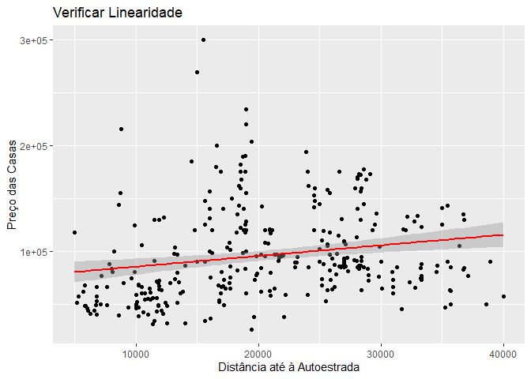

- Porque razão não existe uma relação linear entre a distância até à
  autoestrada e o preço das casas?

A resposta a esta pergunta pode ser mais óbvia do que parece e pode ser
respondida através da definição de externalidade. Se a autoestrada for
demasiado longe o impacto pode ser negativo (falta de comodidade) e se
for demasiado perto o impacto também pode ser negativo (ruído, poluição,
trânsito excessivo). Já se a distância for moderada, o impacto pode ser
positivo, uma vez que existe a acessibilidade sem as externalidades
negativas. Portanto, neste caso, o modelo linear não é adequado.

Uma relação entre duas variáveis mais próxima da linearidade poderia ser
o número de quartos (rooms) e o preço.

``` r
library(ggplot2)

ggplot(hprice3, aes(x = rooms, y = price)) +
  geom_point() +
  geom_smooth(method = "lm", col = "red") +
  labs(title = "Verificar Linearidade",
       x = "Número de Quartos",
       y = "Preço das Casas")
```

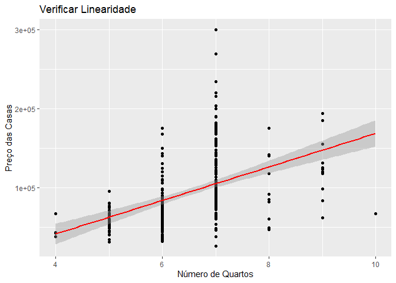

## Pressuposto: As variáveis independentes têm alguma variação

As variáveis independentes devem ter variação, ou seja, não podem ser
constantes. Este pressuposto é importante porque a ausência de variação
nas variáveis independentes torna impossível estimar o efeito dessas
variáveis na variável dependente. Normalmente é o coeficiente de
variação (CV) que é utilizado para medir a variação relativa de uma
variável. O CV é definido como a razão entre o desvio padrão e a média
da variável: <span id="eq-coeficiente_variacao">$$
CV = \frac{\sigma}{\mu}
 \qquad(2)$$</span>

em que $\sigma$ é o desvio padrão e $\mu$ é a média da variável.

Para calcular o coeficiente de variação para a variável `price`, podemos
usar o seguinte código:

``` r
# Calcular coeficiente de variação para a variável price
cv_price <- sd(hprice3$price) / mean(hprice3$price)
cv_price
```

    [1] 0.4497756

O coeficiente de variação é uma medida sem dimensão, o que significa que
não depende das unidades de medida da variável. Um CV próximo de zero
indica pouca variação, enquanto um CV maior indica maior variação. Em
geral, um CV superior a 0,1 (10%) pode ser considerado suficiente para
garantir variação adequada na variável independente.

## Pressuposto: Homocedasticidade dos erros

### O que é?

A homocedasticidade é medida nos resíduos do modelo. Por definição, a
homocedasticidade é quando a variância do termo de erro é constante ao
longo da amostra:

<span id="eq-homocedasticidade">$$
Var(u_i | X_{1i}, X_{2i}, \ldots, X_{ki}) = \sigma^2
 \qquad(3)$$</span>

Quando a variância do termo de erro não é constante ao longo da amostra,
dizemos que há heterocedasticidade. Ou seja:

<span id="eq-heterocedasticidade">$$
Var(u_i | X_{1i}, X_{2i}, \ldots, X_{ki}) = \sigma^2_i
 \qquad(4)$$</span>

O que distingue as duas situações é o índice $i$ na variância.

Exemplo gráfico de homocedasticidade entre `Y`e `X`:

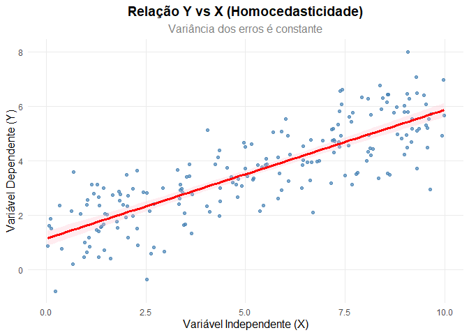

Como podemos observar, a variância dos erros é constante ao longo de uma
faixa de valores de `X`, o que caracteriza a homocedasticidade.

Exemplo gráfico de heterocedasticidade entre `Y`e `Z`:

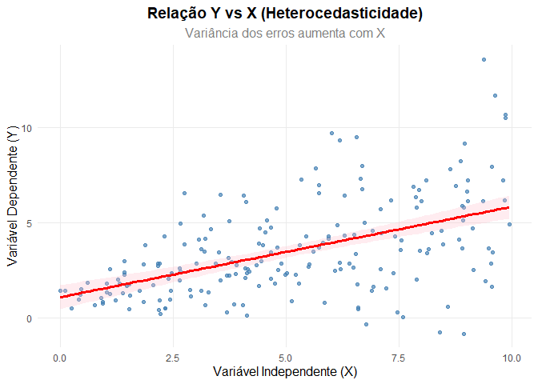

Podemos observar que a variância dos erros aumenta com os valores de
`X`, o que caracteriza a heterocedasticidade.

### Quais as consequências?

A heterocedasticidade pode levar a estimativas ineficientes e testes de
hipóteses inválidos como a significância estatística dos coeficientes. A
heterocedasticidade dos erros subestima a variância dos estimadores e
com isso faz com que os estimadores dos OLS não sejam eficientes. Também
leva a valores elevados das estatísticas. Apesar disso, continuam a ser
consistente e não enviesados.

### Como detetar a heterocedasticidade dos erros?

A heterocedasticidade pode ser detectada através de gráficos e testes.

#### Gráficos de Dispersão

Nestes exemplo vamos utilizar os dados `hprice1` da biblioteca
`wooldridge`. Carregar os dados:

``` r
#limpar ambiente
rm(list = ls())

#carregar bibliotecas
library(wooldridge)
library(tidyverse)

#carregar dados
data("hprice1")
```

Para detetar graficamente a heterocedasticidade necessitamos do valor do
resíduo ao quadrado ($e_i^2$) no eixo das ordenadas e dos valores
previsto da variável dependente $\hat{price}_i$ no eixo das abscissas. O
modelo base será: \$ {price}\_i = \_0 + \_1 lotsize_i + +\_2 sqrft_i +
\_3 bdrms + u_i \$. Vamos estimar o modelo, obter os resíduos, calcular
o quadrado dos resíduos e os valores previstos.

``` r
# Estimar modelo
modelo <- lm(price ~ lotsize + sqrft + bdrms, 
              data = hprice1)

dados_het <- hprice1 %>%
  mutate(
    valores_previstos = fitted(modelo),
    residuos = residuals(modelo),
    residuos_sq = residuos^2
  )
```

Com os dados (no data frame `dados_het`) podemos criar o gráfico de
dispersão:

``` r
# Gráfico de dispersão: resíduos ao quadrado vs valores previstos
ggplot(dados_het, aes(x = valores_previstos, y = residuos_sq)) +
  geom_point(alpha = 0.7, color = "steelblue", size = 1.5) +
  labs(title = "Gráfico de Dispersão: Resíduos ao Quadrado vs Valores Previsto",
       x = "Valores Previsto",
       y = "Resíduos ao Quadrado") +
  theme_minimal() +
  theme(plot.title = element_text(size = 14, face = "bold", hjust = 0.5),
        axis.title = element_text(size = 12),
        panel.grid.minor = element_blank())
```

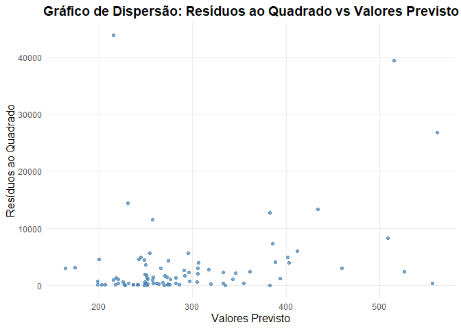

Também é possivel obter o mesmo resultado com a função `plot()`:

``` r
# Gráfico de dispersão: resíduos ao quadrado vs valores previstos
plot(dados_het$valores_previstos, dados_het$residuos_sq,
     xlab = "Valores Previsto",
     ylab = "Resíduos ao Quadrado",
     main = "Gráfico de Dispersão: Resíduos ao Quadrado vs Valores Previsto",
     col = "steelblue", pch = 16, cex = 1.5)
```

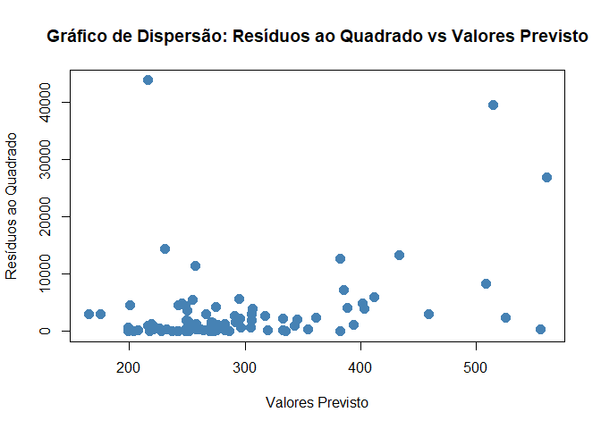

Em qualquer um dos gráfico podemos concluir que existe
heterocedasticidade. Não é possível traçar uma linha completamente
horizontal para representar as obervações do gráfico.

#### Testes de heterocedasticidade

Os testes de heterocedasticidade seguem um processo semelhante, o mais
comum é:

1.  Estimar o modelo e obter os resíduos ($e_i$).
2.  Estimar a regressão auxiliar específica do teste.
3.  Calcular o $LM_{stat}=n*R^2$ da regressão auxiliar.
4.  Comparar o valor do $LM_{stat}$ com o valor crítico da distribuição
    ou o valor de probabilidade $\chi^2$ com graus de liberdade igual ao
    número de variáveis explicativas na regressão auxiliar (sem incluir
    a constante).

#### Teste de Heterocedasticidade condicional

OA heterocedasticidade condicional ocorre quando a variância dos erros
depende das informações passadas, ou seja, a variância dos erros num
determinado período $t$ pode ser influenciada pelos erros em períodos
anteriores $t-1, t-2, \dots, t-n$. Este tipo de heterocedasticidade é
comum em dados financeiros, onde a volatilidade dos retornos pode variar
ao longo do tempo. pode ser diagnosticada com o Teste de ARCH
(Autoregressive Conditional Heteroskedasticity). Graficamente a
heterocedasticidade condicional tem um padrão de “clusters” de
volatilidade, onde períodos de elevada volatilidade são seguidos por
mais períodos de elevada volatilidade, e o mesmo ocorre para períodos de
baixa volatilidade. Exemplo gráfico:

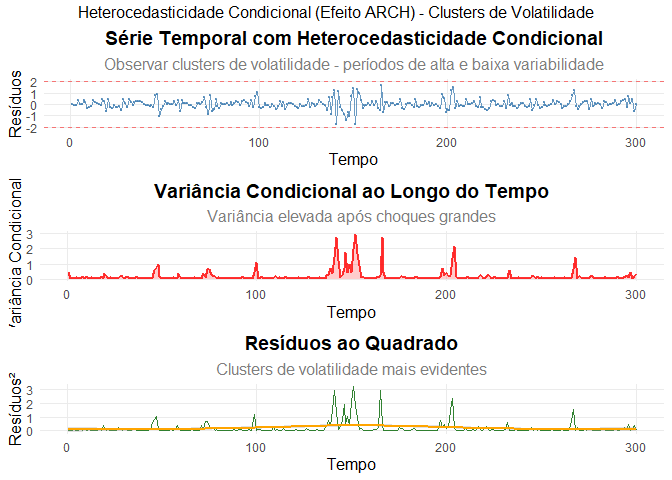

### Como corrigir a heterocedasticidade

Existem algumas abordagens para lidar com a heterocedasticidade:

1.  **Transformações de Variáveis**: Aplicar transformações nas
    variáveis dependentes ou independentes pode ajudar a estabilizar a
    variância. Por exemplo, a transformação logarítmica é frequentemente
    utilizada.

2.  **Ajustar a amostra ou adicionar substituir variáveis**: Rever a
    seleção de variáveis e considerar a inclusão de variáveis omitidas
    que possam estar relacionadas à variância dos erros.

3.  **Modelos de Regressão Robustos**: Ajustar os desvios padrão das
    estimativas dos coeficientes para ter em consideração a
    heterocedasticidade, como os erros padrão de White.

4.  **Método Generalizados dos Mínimos Quadrados**: Que consiste em
    dividir todos os termos da equação de regressão pelo desvio padrão
    dos resíduos.

No método GLS, os resíduos são ponderados de forma a minimizar a
heterocedasticidade. Considerando o seguinte modelo:

<span id="eq-ols-1">$$
Y_i = \beta_0 + \beta_1 X_i + \beta_2 X_i^2 + u_i
 \qquad(5)$$</span>

onde a variância do erro é dada por $Var(u_i) = \sigma^2_i$. Então
dividindo os termos da equaação pelo desvio padrão dos erros temos:

<span id="eq-gls">$$
Y_i = \beta_0(1/\rho_i) + \beta_1(1/\rho_i)X_i + \beta_2(1/\rho_i)X_i^2 + \mu_i(1/\rho_i)
 \qquad(6)$$</span>

ou:

<span id="eq-gls-2">$$
Y'_i = \beta_0' + \beta_1'X_i + \beta_2'X_i^2 +\mu'_i
 \qquad(7)$$</span>

ou seja, $Var(\mu'_i) = Var(\mu_i(/\rho_i))=Var(\mu_i)/\rho^2_i=1$. Com
isto a variância dos erros transformados é constante.

5.  **Método Ponderado do Mínimos Quadrados**: Que consiste em atribuir
    ponderadores diferentes termos da equação.

Neste método, os erros são ponderados de acordo com a variância dos
resíduos, de forma que as observações com maior variância tenham menor
peso na estimação dos parâmetros. Ou seja, as observações com menor
variância terão maior ponderação. Considerando o seguinte modelo:

<span id="eq-ols-2">$$
Y_i = \beta_0 + \beta_1 X_i + \beta_2 X_i^2 + u_i
 \qquad(8)$$</span>

com o ponderador $w_i$:

<span id="eq-ols-2">$$
w_i {Y_i} = w_i \beta_0 + \beta_1 w_i X_i + \beta_2 w_i X_{2i} + u_i w_i
 \qquad(9)$$</span>

A aplicação destes métodos será desenvolvida no
**?@sec-extensoes-regressao**.

## Pressuposto: Ausência de Autocorrelação dos erros

### O que é?

A autocorrelação ocorre quando os resíduos de um modelo de regressão não
são independentes entre si, ou seja, há correlação entre os erros em
diferentes observações. O modelo clássico de regressão linear assume que
as covariâncias e correlações entre os erros são zero:

<span id="eq-ausencia-autocorrelacao">$$
Cov(u_i, u_j | X) = 0 \text{ para } i \neq j
 \qquad(10)$$</span>

A covariância é uma medida que indica a direção da relação linear entre
duas variáveis. No contexto da autocorrelação, a covariância entre os
erros em diferentes períodos de tempo deve ser zero para que os erros
sejam considerados não correlacionados. A autocorrelação dos erros é
mais provável em séries temporais. Já nos dados seccionais podemos
reordenar os dados sem alterar os resultados.

Umas das principais causas da autocorrelação é a omissão de variáveis
relevantes no modelo. Por exemplo, temos um modelo em que $Y$ é a
variável dependente e $X_1$ e $X_2$ são as variáveis independentes. Se
omitirmos uma variável relevante, como $X_3$, essa informação vai ser
capturada pelos erros do modelo e ainda se essa variável tiver tendência
(como muitas variáveis em economia) então $X_{3t}$ depende de
$X_{3t-1}$, $X_{3t-p}$… Consequentemente, os erros também vão depender
de momentos anteriores, ou seja, $u_t$ vai depender de $u_{t-1}$,
$u_{t-p}$…

Outra possível causa para a existência de autocorrelação é a má
especificação dos modelos. Quanto a relação de $Y$ e $X$ não é linear e
utilizamos um modelo linear ($Y = \beta_0 + \beta_1 X + u$) em vez de um
não linear ($Y=\beta_0 + \beta_1 X + \beta_2 X^2 + u$). Os erros obtidos
do modelo linear também podem apresentar autocorrelação.

Um erro sistematico de medição também pode ser uma das razões para a
existência de autocorrelação. Por exemplo, num inventário de um armazém
que é atualizado de x em x tempo ocorrer um erro sistemático na
contagem, esse erro vai ser refletido nos erros seguintes no inventário
acumulado.

A autocorrelação pode ser de várias ordens. A mais comum é a de ordem 1.
Para o modelo:

<span id="eq-modelo-autocorr">$$
Y_t = \beta_0 + \beta_1 X_t + u_t
 \qquad(11)$$</span>

em que:

- $Y_t$ é a variável dependente no tempo $t$.
- $X_t$ é a variável independente no tempo $t$.
- $u_t$ é o termo de erro no tempo $t$.

Na auutocorrelação de ordem 1 temos:

<span id="eq-autocorr-1">$$
\mu_i = \rho \mu_{i-1} + \epsilon_i
 \qquad(12)$$</span>

ou seja, o erro no tempo $t$ depende do erro desfasado um vez ($t-1$). O
$\rho$ é o coeficiente de autocorrelação que mede a força e a direção da
relação entre dos erros em diferentes períodos de tempo. O valor de
$\rho$ varia entre -1 e 1. Com isso podemos ter três casos:

1.  **$\rho = 0$**: Não existe autocorrelação.
2.  **$0 < \rho < 1$**: Autocorrelação positiva (erros positivos tendem
    a ser seguidos por erros positivos).
3.  **$-1 < \rho < 0$**: Autocorrelação negativa (erros positivos tendem
    a ser seguidos por erros negativos).

Exemplo gráfico sem autocorrelação, $\rho = 0$:

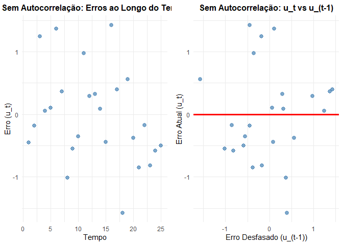

O declive do segundo gráfico é igual a 0, o que indica que não há
relação entre o erro atual e o erro desfasado.

Exemplo gráfico de Autocorrelação Positiva, $\rho > 0$:

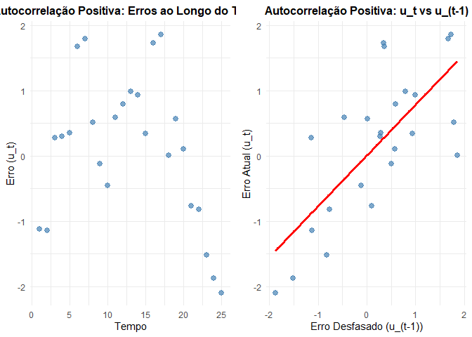

No 1º gráfico podemos observar, de forma genérica, que os erros
positivos tendem a ser seguidos por erros positivos e os erros negativos
por erros negativos. No 2º gráfico, a relação entre o erro atual e o
erro desfasado é capturada pela linha de regressão, que mostra uma
tendência positiva.

Exemplo gráfico de Autocorrelação Negativa, $\rho < 0$:

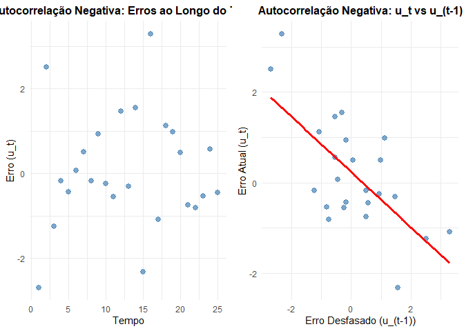

No 1º gráfico podemos observar, de forma genérica, que os erros
positivos tendem a ser seguidos por erros negativos e os erros negativos
por erros positivos. No 2º gráfico, a relação entre o erro atual e o
erro desfasado é capturada pela linha de regressão, que mostra uma
tendência negativa.

A autocorrelação pode ser de outras ordens:

- ordem 2:

<span id="eq-autocorrelacao-2">$$
\mu_t = \rho_1 \mu_{t-1} + \rho_2 \mu_{t-2} + \epsilon_t
 \qquad(13)$$</span>

- ordem p:

<span id="eq-autocorrelacao-p">$$
\mu_t = \sum_{i=1}^{p} \rho_i \mu_{t-i} + \epsilon_t
 \qquad(14)$$</span>

### Quais as consequências?

Os estimadores do MMQ permanecem não enviesados e consistentes. Contudo,
são ineficientes, pois a presença de autocorrelação altera a variância
dos estimadores. Com isto, os testes de hipóteses podem ser inválidos,
os resultados podem “parecer” melhores do que realmente são (variáveis
estatisticamente significantes quando na realidade não o são) O $R^2$
também pode ser inflacionado.

### Como detetar a autocorrelação dos erros?

A autocorrelação pode ser detectada de duas formas, tal como a
heterocedasticidade: gráficamente e através de teste formais. Os
gráficos de dispersão dos resíduos com $u_t$ em função de $u_{t-1}$
podem revelar padrões de autocorrelação, como visto anteriormente.
Existem alguns testes formais em que a aplicação depende do contexto
como a presença de desfasamentos na variavel dependente ou nas
dependentes. A hipótese nula é a ausência de autocorrelação. Os teste
formais serão aplicados mais à frente na **?@sec-avaliacao-modelos**.

### Como corrigir a autocorrelação?

A autocorrelação pode ser corrigida através de métodos como o
Cochrane-Orcutt ou da transformação dos dados. Será abordado mais à
frente no **?@sec-extensoes-regressao** juntamente com a correção
heterocedasticidade.

## Pressuposto: Normalidade dos Erros

### O que é?

Os erros do modelo devem seguir uma distribuição normal. Este
pressuposto é especialmente importante aquando da realização de testes
de hipóteses e construção de intervalos de confiança. A normalidade dos
erros é expressa como:

<span id="eq-normalidade-erros">$$
\epsilon_i \sim N(\mu, \sigma^2)
 \qquad(15)$$</span>

em que: - $\epsilon_i$ são os erros do modelo - $N(\mu, \sigma^2)$
indica que os erros seguem uma distribuição normal com média $\mu$ e
variância $\sigma^2$

Para os testes t e F tenham as propriedades (em pequenas amostras),
assume-se que os erros seguem uma distribuição normal, para que os
resultados sejam válidos. No entanto, em grandes amostras, o Teorema
Central do Limite garante que a distribuição dos erros tende a ser
normal, independentemente da distribuição original.

- Porque a normalidade é tão popular?

A normalidade dos erros tem uma interpretação intuitiva, a a ideia de
erros simétricos (curtose) em torno de uma média. Existe também uma
conveniência histórica na utilização da normalidade, uma vez que muitos
métodos estatísticos clássicos foram desenvolvidos considerando este
pressuposto.

Exemplo gráfico de normalidade e não normalidade:

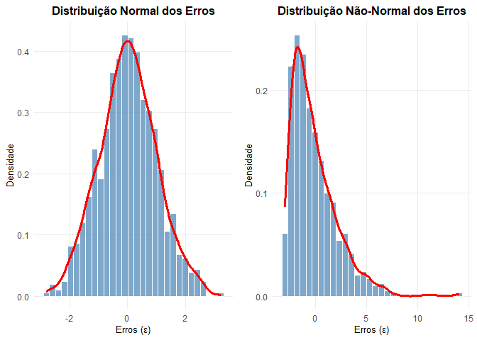

### Quais as consequências?

Como mencionado anteriormente, a violação do pressuposto de normalidade
pode levar a inferências estatísticas inválidas, especialmente em testes
de hipóteses. Uma vez que os testes t e F dependem da normalidade dos
erros para serem válidos, a não normalidade pode resultar em taxas de
erro tipo I e tipo II incorretas. No entanto, em grandes amostras, o
Teorema Central do Limite ajuda a mitigar essas preocupações, tornando
os testes mais robustos à violação da normalidade. Um erro do tipo I
ocorre quando rejeitamos a hipótese nula quando é verdadeira, enquanto
um erro do tipo II ocorre quando não rejeitamos a hipótese nula quando é
falsa.

### Como verificar a não normalidade dos erros?

A normalidade dos erros pode ser verificada através de gráficos e testes
estatísticos. O primeiro passo é estimar o modelo e armazenar os
resíduos. Os gráficos os mais indicados são os histogramas e os gráficos
Q-Q (quantil-quantil). Um histograma dos resíduos mostra a sua
distribuição (achatamento e deslocamento). O gráfico Q-Q mostra a
relação entre os quantis dos resíduos e os quantis de uma distribuição
normal. Um quantil é um valor que divide a distribuição em partes
iguais, por exemplo, o quantil 0,5 (ou mediana) divide a distribuição em
duas partes iguais. Nos testes estatísticos, os mais comuns são o teste
de Jarque-Bera e o teste de Shapiro-Wilk. O teste de Jarque-Bera é um
teste de bondade de ajuste que verifica se os resíduos seguem uma
distribuição normal, baseando-se na assimetria e curtose dos resíduos.
Em ambos os testes a hipótese nula é de que os resíduos seguem uma
distribuição normal.

### Como lidar com a não normalidade dos erros?

Como já foi referido anteriormente, em amostras grandes a distribuição
dos erros tende a aproximar-se da normalidade (Teorema do Limite
Central). No entanto, quando a não normalidade é uma preocupação,
existem várias abordagens que podem ser adotadas.

Uma abordagem comum para lidar com a não normalidade dos erros é a
transformação dos dados. Transformações como a logarítmica ou Box-Cox
podem ajudar a estabilizar a variância e tornar os erros mais normais.
Além disso, métodos robustos de estimação, como a regressão quantílica,
podem ser utilizados para obter inferências mais confiáveis na presença
de não normalidade.

No próximo capítulo, estudaremos métodos para avaliar e comparar modelos
de regressão.

## Pressuposto: Ausência de Multicolinearidade

### O que é?

A multicolinearidade ocorre quando duas ou mais variáveis independentes
de um modelo de regressão estão correlacionadas entre si. Existem dois
tipos de multicolinearidade:

- Multicolinearidade perfeita: as variáveis estão exatamente
  correlacionadas. Considerando o seguinte modelo:

$$
Y = \beta_0 + \beta_1 X_1 + \beta_2 X_2 + \epsilon
$$ {#eq.multicolinearidade_perfeita}

em que:

$$
X_1 = 3 X_2
$$ {#eq.multicolinearidade_perfeita\_}

Exemplo de multicolinearidade perfeita:

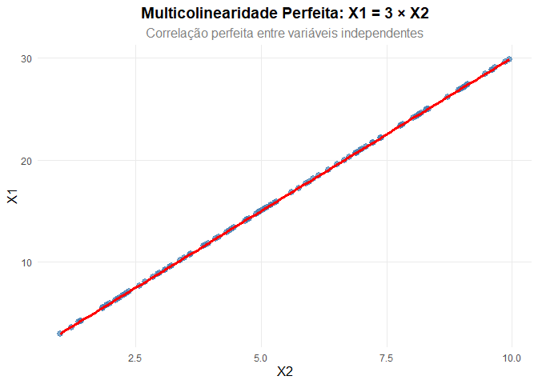

É possível determinar $X_1$ através de $X_2$, ou seja, através de uma
função linear.

- Multicolinearidade imperfeita: as variáveis estão correlacionadas, mas
  não através de uma constante. Considerando o modelo:

$$
W = \beta_0 + \beta_1 Z_1 + \beta_2 Z_2 + \epsilon
$$ {#eq.multicolinearidade_imperfeita}

em que:

$$
Z_1 =Z_2+\phi
$$ {#eq.multicolinearidade_imperfeita\_}

onde o erro $\phi$ é uma variável aleatória.

Exemplo Gráfico de multicolinearidade imperfeita:

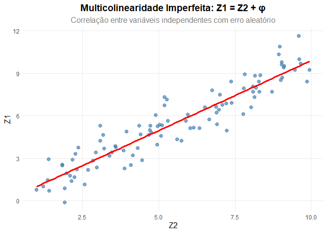

### Quais as consequências?

Quando existe multicolinearidade perfeita não é possível estimar os
coeficientes do modelo. Na multicolinearidade imperfeita, os
coeficientes podem ser estimados, mas a presença de multicolinearidade
pode levar ao aumento da variância dos coeficientes estimados e
consequente diminuição do $t_{stat}$. Isto pode levar a conclusões
erradas sobre a importância das variáveis independentes no modelo. A
multicolinearidade também pode alterar a interpretação dos coeficientes,
uma vez que as mudanças numa variável independente podem estar
associadas a mudanças noutra variável independente. Além disso, a
multicolinearidade pode tornar o modelo mais sensível a pequenas
mudanças nos dados, o que pode afetar a estabilidade das estimativas dos
coeficientes.

### Como diagnosticar?

Existem várias maneiras de detectar a multicolinearidade:

1.  **Análise Gráfica**: Criar gráficos de dispersão entre pares de
    variáveis independentes pode ajudar a identificar relações lineares
    fortes.

2.  **Matriz de Correlação**: Calcular a matriz de correlação entre as
    variáveis independentes. Correlações altas (próximas de 1 ou -1)
    podem indicar multicolinearidade.

3.  **VIF (Variance Inflation Factor)**: O VIF mede quanto a variância
    de um coeficiente de regressão aumenta devido à multicolinearidade.
    Um VIF acima de 5 ou 10 é frequentemente utilizado como valore de
    referência (convenção).

4.  **Regressão**: Quando o modelo estimado apresenta coeficientes
    estatisticamente iguais a zero (valor P elevado) e o coeficiente de
    determinação (R²) é elevado pode indicar a presença de
    multicolinearidade.

5.  **Regressão entre as variáveis independentes**: Estimar um modelo de
    regressão onde uma variável independente é explicada por outra
    variável independente ($R^2$ da regressão auxiliar muito elevado)
    pode ajudar a identificar multicolinearidade imperfeita.

### Como lidar com a multicolinearidade?

Existem várias abordagens para lidar com a multicolinearidade:

1.  **Remover Variáveis**: Se duas ou mais variáveis estão altamente
    correlacionadas, pode ser útil remover uma delas do modelo.

2.  **Combinar ou transformar Variáveis**: Criar índices, logarítmos,
    primeiras diferenças, variáveis centradas ($x_i-\bar{x}$) etc.

3.  **Alterar a frequência dos dados ou horizonte temporal**: mudar de
    uma frequência anual para mensal (se disponível) ou aumentar a
    amostra.

4.  **Regularização**: Métodos como a regressão Lasso e Ridge ou a
    Análise de Componentes Principais (PCA) também podem ser utilizados.

De notar que em séries temporais existe sempre algum grau de
multicolinearidade entre as variáveis independentes.

## Pressuposto: Valor Esperado do Erro é Zero

O pressuposto de que o valor esperado do erro é zero implica que, em
média, os erros deverá se zero. Ou seja:

<span id="eq-erro-zero">$$
E(u_i) = 0
 \qquad(16)$$</span>

No `R` podemos verificar este pressuposto através do seguinte código:

``` r
# Ajustar o modelo
modelo <- lm(y ~ x1 + x2, data = dados)

# Verificar o pressuposto
mean(residuals(modelo))
mean(residuals(modelo))
```

Naturalmente, este pressuposto é fundamental para garantir que as
estimativas dos coeficientes do modelo sejam não viesadas e que a
inferência estatística seja válida.

## Pressuposto: As variáveis independentes não são estocásticas

Este pressuposto implica que as variáveis independentes devem ser fixas
ou determinadas antes da observação do erro. Em outras palavras, as
variáveis independentes não devem ser influenciadas por fatores
aleatórios que também afetam a variável dependente.

No próximo capítulo, vamos explorar a aplicação destes pressupostos e
outros aspectos a ter em conta nos modelos de regressão.
